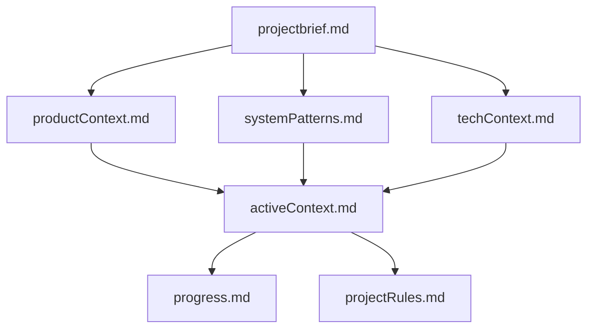
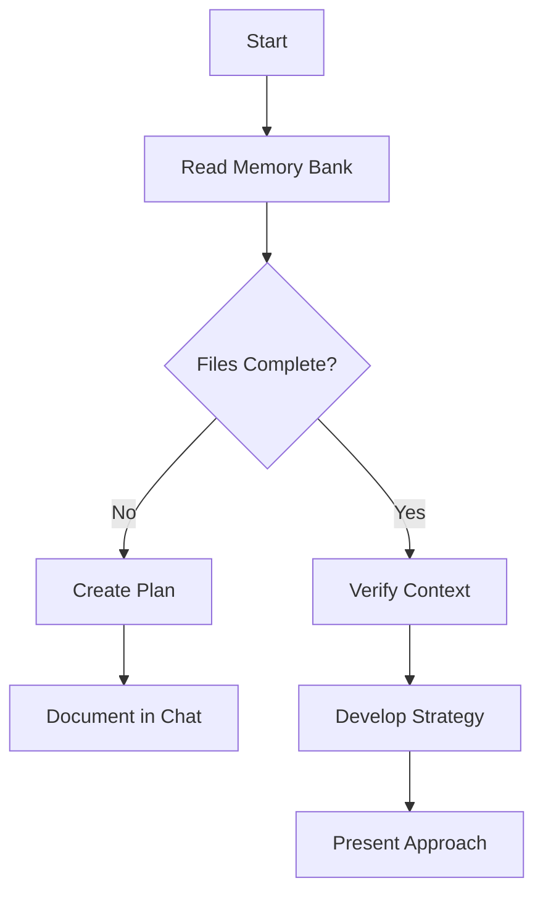
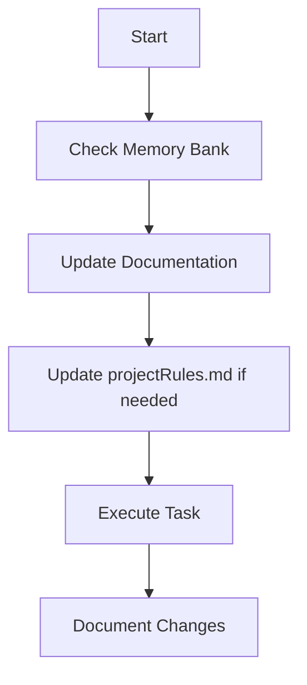

# Implementing a Memory Bank System with Cursor Rules

> **TL;DR**: This guide explains how to implement a persistent memory system for
> Cursor using rules. The Memory Bank keeps context across coding sessions by
> reading and updating markdown files, ensuring your AI assistant remembers
> project details even when sessions restart.

## Table of Contents

1. [Introduction](#introduction)
2. [Understanding Memory Bank Concepts](#understanding-memory-bank-concepts)
3. [Memory Types and Cognitive Model](#memory-types-and-cognitive-model)
4. [Memory Bank File Structure](#memory-bank-file-structure)
5. [Memory Hierarchy and Dependencies](#memory-hierarchy-and-dependencies)
6. [Setting Up Memory Bank Rules](#setting-up-memory-bank-rules)
7. [Workflow Modes: Plan and Act](#workflow-modes-plan-and-act)
8. [Using the Memory Bank](#using-the-memory-bank)
9. [Autonomous Memory Management](#autonomous-memory-management)
10. [End-of-Session Protocols](#end-of-session-protocols)
11. [Best Practices and Maintenance](#best-practices-and-maintenance)
12. [Troubleshooting Common Issues](#troubleshooting-common-issues)
13. [Advanced Configurations](#advanced-configurations)
14. [Acknowledgments](#acknowledgments)

## Introduction

AI coding assistants like Cursor are powerful but forgetful. When you start a
new session or when the context window fills up, the AI loses important project
context. This means you waste time re-explaining your project, technology stack,
architectural decisions, and coding preferences.

This guide demonstrates how to implement a "Memory Bank" system for Cursor,
inspired by the Cline Memory Bank and enhanced with concepts from LLM agent
memory research, which allows the AI to maintain context across sessions by:

1. Storing important project information in structured markdown files
2. Automatically reading these files at the beginning of each session
3. Updating the files as your project evolves
4. Maintaining continuity across coding sessions through persisted memory
5. Supporting different workflow modes for planning and execution
6. Enabling intelligent, autonomous memory management

When properly implemented, your Memory Bank becomes your AI's external memory
system - like the detective in Memento who uses notes and photos to remember
important facts after memory loss.

## Understanding Memory Bank Concepts

### The Problem: AI Amnesia

AI assistants operate with a limited context window (32k-200k tokens). This
means:

- When you hit the limit, context gets truncated
- When you start a new session, all previous context is lost
- You must repeatedly explain project details to the AI

### The Solution: Persistent Memory Through Files

The Memory Bank solves this by:

1. **Creating a structured file system** that serves as external memory
2. **Using Cursor rules** to automatically check these files before working
3. **Maintaining a living documentation system** that evolves with your project
4. **Implementing memory update routines** to keep context fresh
5. **Supporting cognitive memory models** for better information organization
6. **Enabling workflow modes** tailored to different development activities

### Core Memory Bank Principles

1. **Memory Persistence**: Store context in files that survive between sessions
2. **Structured Documentation**: Organize information in a consistent,
   retrievable format
3. **Automatic Context Loading**: Use rules to ensure the AI checks memory files
4. **Regular Updates**: Keep memory files current with project changes
5. **Priority Information**: Focus on storing the most important context
   elements
6. **Memory Hierarchy**: Establish clear relationships between memory files
7. **Autonomous Management**: Enable AI to suggest memory updates proactively
8. **Dual Workflow Modes**: Support both planning and execution activities

## Memory Types and Cognitive Model

Drawing from cognitive science and LLM agent research, the Memory Bank system
implements a multi-layered memory model:

### Working Memory

The AI's context window serves as working memory - temporary, active information
currently being processed. The Memory Bank extends this with persistent storage.

### Long-Term Memory

The Memory Bank implements three types of long-term memory:

1. **Episodic Memory**: Records of experiences and events

   - Project milestones and key decision points
   - Significant challenges and their resolutions
   - Session histories and development narratives

2. **Semantic Memory**: Knowledge about the project and its domain

   - Technical concepts and terminology
   - Business domain understanding
   - User requirements and expectations

3. **Procedural Memory**: Knowledge about how to perform actions
   - Development workflows
   - Testing procedures
   - Deployment processes
   - Coding patterns and conventions

### Memory Organization

These memory types are organized across the Memory Bank structure:

```
memory-bank/
├── Core files         # Primary semantic & procedural memory
├── projectRules.md    # Learned patterns & procedural memory
└── additional/
    ├── episodic/      # Episodic memory storage
    ├── semantic/      # Detailed semantic memory
    └── procedural/    # In-depth procedural memory
```

## Memory Bank File Structure

The Memory Bank consists of several key files organized in a `memory-bank/`
directory at your project root:

```
memory-bank/
├── projectbrief.md       # Project overview, goals, and requirements
├── productContext.md     # Business logic and user experience goals
├── activeContext.md      # Current work focus and recent changes
├── systemPatterns.md     # Technical architecture and patterns
├── techContext.md        # Technology stack and development setup
├── progress.md           # Project status and roadmap
├── projectRules.md       # Learned patterns and project intelligence
└── additional/           # Extended memory storage
    ├── episodic/         # Experience-based memory
    │   ├── milestones/   # Key project milestones
    │   └── sessions/     # Significant session summaries
    ├── semantic/         # Knowledge-based memory
    │   ├── domain/       # Domain concepts
    │   ├── apis/         # API documentation
    │   └── features/     # Feature specifications
    ├── procedural/       # Action-based memory
    │   ├── workflows/    # Development workflows
    │   ├── guides/       # How-to guides
    │   └── checklists/   # Operational checklists
    └── decisions/        # Decision records
```

### Core Files Description

1. **projectbrief.md**: Foundation document defining core requirements, scope,
   and project objectives

2. **productContext.md**: Explains the product from a business and user
   perspective

   - Problem the product solves
   - Target users and use cases
   - Key user journeys
   - Business goals and success metrics

3. **activeContext.md**: Tracks current development focus

   - Current sprint/iteration goals
   - Recently completed changes
   - Ongoing work
   - Known issues or blockers
   - Current workflow mode (Plan or Act)

4. **systemPatterns.md**: Documents the technical architecture

   - System components and relationships
   - Design patterns used
   - Code organization principles
   - Key architectural decisions

5. **techContext.md**: Details the technology landscape

   - Programming languages and versions
   - Frameworks and libraries
   - Development tools and configuration
   - Environment setup instructions

6. **progress.md**: Tracks project progress

   - Working features
   - Features in development
   - Planned features
   - Known bugs or limitations

7. **projectRules.md**: New! Captures project intelligence and learned patterns
   - Coding patterns specific to the project
   - User preferences and workflow habits
   - Implementation approaches for common tasks
   - Known challenges and their solutions

## Memory Hierarchy and Dependencies

The Memory Bank files form a hierarchical relationship rather than existing as
independent documents. Understanding this hierarchy helps maintain consistency:



### Hierarchy Layers

1. **Foundation Layer**:

   - **projectbrief.md** - The source of truth for project scope and goals
   - Changes here affect all downstream documents

2. **Context Layer**:

   - **productContext.md** - Builds on project brief with product focus
   - **systemPatterns.md** - Builds on project brief with technical architecture
   - **techContext.md** - Builds on project brief with technology stack
   - Changes here must align with the project brief

3. **Activity Layer**:

   - **activeContext.md** - Synthesizes information from all context layers
   - Changes most frequently as it tracks current work

4. **Tracking Layer**:
   - **progress.md** - Builds on active context with completion status
   - **projectRules.md** - Evolves based on observed patterns and preferences
   - These files adapt based on development activities

### Conflict Resolution

When information conflicts between memory files, use this priority order:

1. activeContext.md (most recent information)
2. systemPatterns.md (architectural constraints)
3. techContext.md (technical constraints)
4. projectbrief.md (foundational requirements)

## Setting Up Memory Bank Rules

The Memory Bank system relies on Cursor rules to function properly. We'll
implement this with five key rules:

1. **Memory Bank Core**: The primary rule that instructs Cursor to check memory
   files
2. **Memory Bank Update**: Commands and patterns for updating memory
3. **Memory Bank Creation**: Templates and structure for initializing memory
   files
4. **Memory Bank Workflow**: New! Supports Plan and Act modes
5. **Memory Bank Bedtime**: New! End-of-session protocols

Let's implement each rule:

### 1. Memory Bank Core Rule

Create a file at `.cursor/rules/Core/700-memory-bank-core.mdc`:

```md
---
description:
  WHEN starting ANY task ENSURE checking memory-bank files BEFORE proceeding
globs:
alwaysApply: true
---

> **TL;DR:** Before responding to any request, always check the memory-bank
> directory to understand project context, technical architecture, and current
> work focus.

# Memory Bank System

## 🚨 CRITICAL REQUIREMENTS

BEFORE starting any task or providing any response, you MUST:

1. Check if memory-bank/ directory exists

   - If it does not exist, offer to initialize it
   - If it exists, read ALL mandatory files

2. Read these files IN ORDER:

   - memory-bank/projectbrief.md
   - memory-bank/productContext.md
   - memory-bank/systemPatterns.md
   - memory-bank/techContext.md
   - memory-bank/activeContext.md
   - memory-bank/progress.md
   - memory-bank/projectRules.md (if exists)

3. Incorporate the context from these files into your understanding

   - Use this context to guide all responses
   - Ensure solutions align with documented patterns
   - Respect technical decisions already made
   - Follow project rules and learned patterns

4. Check the current workflow mode
   - Identify if in PLAN mode or ACT mode
   - Adjust response approach accordingly

## 📋 MEMORY BANK PROTOCOL

1. NEVER proceed with a complex task if memory-bank files don't exist
2. ALWAYS suggest initializing memory-bank if missing
3. ONLY read specific additional memory files when directly relevant
4. NEVER make up false information if memory files are missing or incomplete
5. When memory files contain contradictions, prioritize files in this order:
   - activeContext.md (most recent)
   - systemPatterns.md (architecture rules)
   - techContext.md (technology constraints)
   - projectbrief.md (core requirements)
```

### 2. Memory Bank Update Rule

Create a file at `.cursor/rules/Core/710-memory-bank-update.mdc`:

```md
---
description:
  WHEN user asks to update memory bank ENSURE following proper update procedure
globs:
alwaysApply: true
---

> **TL;DR:** This rule defines how to properly update memory-bank files when
> requested, ensuring consistent information storage.

# Memory Bank Update Protocol

## 📝 UPDATE COMMANDS

Recognize these update commands from the user:

- "update memory bank"
- "update memory"
- "refresh memory bank"
- "update context"
- "save to memory bank"

## 🔄 UPDATE PROCEDURE

When an update is requested:

1. Review ALL existing memory-bank files
2. Identify which files need updates based on recent work
3. For each file requiring updates:
   - Preserve existing structure
   - Add new information in the appropriate sections
   - Update outdated information
   - Resolve any contradictions
   - Maintain concise, well-organized content
4. After updating, provide a summary of changes made

## 📊 UPDATE PRIORITIES

When updating memory-bank files, prioritize:

1. **activeContext.md**: ALWAYS update with:

   - Current work focus
   - Recent changes
   - Ongoing challenges
   - Immediate next steps
   - Current workflow mode

2. **progress.md**: Update when:

   - Features are completed
   - New bugs are discovered
   - Milestones are reached
   - Plans change

3. **projectRules.md**: Update when:

   - New patterns are observed
   - User preferences are identified
   - Implementation approaches are established
   - Challenges and solutions are discovered

4. **systemPatterns.md**: Update when:

   - New design patterns are introduced
   - Architecture changes occur
   - Code organization evolves
   - New standards are established

5. **techContext.md**: Update when:

   - New technologies are added
   - Dependencies change
   - Environment configurations change
   - Development tools change

6. Only update **projectbrief.md** and **productContext.md** when:
   - Core requirements change
   - Project scope changes
   - Business goals evolve
   - Target users change

## 🧠 AUTONOMOUS MEMORY MANAGEMENT

When important patterns or insights emerge, even without explicit update
commands:

1. Proactively suggest updating relevant memory files
2. Highlight the specific information that should be captured
3. Explain why the information is important for future context
4. Recommend the appropriate file and section for the update

When suggesting autonomous updates:

- Be specific about what should be captured
- Explain the potential future value of the information
- Respect user preferences about memory update frequency
```

### 3. Memory Bank Creation Rule

Create a file at `.cursor/rules/Core/720-memory-bank-creation.mdc`:

```md
---
description:
  WHEN user asks to initialize memory bank ENSURE creating proper structure with
  templates
globs:
alwaysApply: true
---

> **TL;DR:** This rule provides templates and instructions for initializing the
> memory-bank directory with properly structured files.

# Memory Bank Initialization

## 🏗️ INITIALIZATION COMMANDS

Recognize these initialization commands from the user:

- "initialize memory bank"
- "create memory bank"
- "setup memory bank"
- "create memory files"
- "start memory bank"

## 📁 CREATION PROCEDURE

When initialization is requested:

1. Create the memory-bank/ directory if it doesn't exist
2. Create all seven core files with template content
3. Prompt user for key project information to customize templates
4. Create the additional/ subdirectory with empty folders
5. Provide guidance on how to use the memory bank

## 📄 FILE TEMPLATES

### projectbrief.md Template
```

# Project Brief

## Project Overview

[Brief description of the project]

## Core Requirements

- [Requirement 1]
- [Requirement 2]
- [Requirement 3]

## Project Goals

- [Goal 1]
- [Goal 2]
- [Goal 3]

## Scope and Constraints

- [Scope item 1]
- [Scope item 2]
- [Constraint 1]
- [Constraint 2]

```

### productContext.md Template
```

# Product Context

## Problem Statement

[Describe the problem this product solves]

## Target Users

- [User type 1]
- [User type 2]

## Key Use Cases

- [Use case 1]
- [Use case 2]
- [Use case 3]

## Business Goals

- [Business goal 1]
- [Business goal 2]

## Success Metrics

- [Metric 1]
- [Metric 2]

```

### activeContext.md Template
```

# Active Context

## Current Focus

[What is currently being worked on]

## Workflow Mode

[PLAN or ACT]

## Recent Changes

- [Change 1] - [Date]
- [Change 2] - [Date]

## Ongoing Work

- [Task 1]
- [Task 2]

## Next Steps

- [Next step 1]
- [Next step 2]

## Blockers

- [Blocker 1]
- [Blocker 2]

```

### systemPatterns.md Template
```

# System Patterns

## Architecture Overview

[Brief description of the system architecture]

## Key Components

- [Component 1]: [Description]
- [Component 2]: [Description]

## Design Patterns

- [Pattern 1]: [Usage context]
- [Pattern 2]: [Usage context]

## Code Organization

- [Organization principle 1]
- [Organization principle 2]

## Key Interfaces

- [Interface 1]: [Purpose]
- [Interface 2]: [Purpose]

```

### techContext.md Template
```

# Technical Context

## Technology Stack

- **Languages**: [Languages used]
- **Frameworks**: [Frameworks used]
- **Libraries**: [Key libraries]
- **Database**: [Database technology]
- **Infrastructure**: [Hosting/deployment]

## Development Environment

- [Setup requirement 1]
- [Setup requirement 2]

## Build and Deployment

- [Build process]
- [Deployment procedure]

## Testing Strategy

- [Testing approach]
- [Test frameworks]

```

### progress.md Template
```

# Project Progress

## Completed Features

- [Feature 1]
- [Feature 2]

## In Development

- [Feature 3]
- [Feature 4]

## Planned Features

- [Feature 5]
- [Feature 6]

## Known Issues

- [Issue 1]
- [Issue 2]

```

### projectRules.md Template
```

# Project Rules

## Coding Patterns

- [Pattern 1]: [Description and context]
- [Pattern 2]: [Description and context]

## User Preferences

- [Preference 1]: [Description]
- [Preference 2]: [Description]

## Implementation Approaches

- [Task type 1]: [Preferred approach]
- [Task type 2]: [Preferred approach]

## Known Challenges

- [Challenge 1]: [Solution approach]
- [Challenge 2]: [Solution approach]

```

## 📂 ADDITIONAL DIRECTORIES

Also create these directories for extended memory:

```

memory-bank/additional/ ├── episodic/ │ ├── milestones/ │ └── sessions/ ├──
semantic/ │ ├── domain/ │ ├── apis/ │ └── features/ ├── procedural/ │ ├──
workflows/ │ ├── guides/ │ └── checklists/ └── decisions/

````

### 4. Memory Bank Workflow Rule

Create a file at `.cursor/rules/Core/730-memory-bank-workflow.mdc`:

```md
---
description:
  WHEN user switches workflow mode ENSURE following appropriate mental model
globs:
alwaysApply: true
---

> **TL;DR:** This rule defines two distinct workflow modes - Plan and Act - each with different approaches to problem-solving and development activities.

# Memory Bank Workflow Modes

## 🔄 WORKFLOW MODES

Two primary workflow modes are supported:

1. **Plan Mode**: For strategic discussions and approach planning
2. **Act Mode**: For implementation and execution

## 📋 MODE SWITCHING COMMANDS

Recognize these mode switching commands:

- "switch to plan mode"
- "enter plan mode"
- "use plan mode"
- "switch to act mode"
- "enter act mode"
- "use act mode"

## 🧠 PLAN MODE WORKFLOW

```mermaid
flowchart TD
    Start[Start] --> ReadFiles[Read Memory Bank]
    ReadFiles --> CheckFiles{Files Complete?}

    CheckFiles -->|No| Plan[Create Plan]
    Plan --> Document[Document in Chat]

    CheckFiles -->|Yes| Verify[Verify Context]
    Verify --> Strategy[Develop Strategy]
    Strategy --> Present[Present Approach]
````

When operating in Plan mode:

1. **Thorough Investigation**

   - Explore requirements in depth
   - Examine existing code thoroughly
   - Research potential approaches extensively
   - Consider multiple alternatives for implementation

2. **Strategic Thinking**

   - Focus on architecture and design patterns
   - Consider long-term implications
   - Identify potential risks and constraints
   - Develop comprehensive implementation plans

3. **Documentation Focus**
   - Create detailed plans before action
   - Document approach rationale
   - Outline steps for implementation
   - Record expected outcomes and validation approaches

## 🛠️ ACT MODE WORKFLOW

```mermaid
flowchart TD
    Start[Start] --> Context[Check Memory Bank]
    Context --> Update[Update Documentation]
    Update --> Rules[Update projectRules.md if needed]
    Rules --> Execute[Execute Task]
    Execute --> Document[Document Changes]
```

When operating in Act mode:

1. **Implementation Focus**

   - Execute previously planned approaches
   - Implement code changes methodically
   - Follow established patterns and standards
   - Focus on efficient, high-quality execution

2. **Practical Problem Solving**

   - Resolve immediate issues
   - Apply established patterns
   - Implement specific features or fixes
   - Focus on concrete, actionable steps

3. **Real-Time Documentation**
   - Document changes as they occur
   - Update progress tracking consistently
   - Record implementation decisions
   - Note any deviations from the plan

## 🔄 MODE TRANSITIONS

The current mode should be recorded in activeContext.md.

When switching modes:

1. Update activeContext.md with the new mode
2. Adjust working approach accordingly
3. Inform the user of the mode change
4. Explain how the approach will differ

Different tasks may benefit from different modes:

- Use Plan mode for: architecture design, feature planning, research
- Use Act mode for: implementing features, fixing bugs, refactoring

````

### 5. Memory Bank Bedtime Protocol

Create a file at `.cursor/rules/Core/740-memory-bank-bedtime.mdc`:

```md
---
description:
  WHEN user initiates bedtime protocol ENSURE comprehensive memory update
globs:
alwaysApply: true
---

> **TL;DR:** This rule defines end-of-session protocols to ensure memory is thoroughly updated before ending a development session.

# Memory Bank Bedtime Protocol

## 🌙 BEDTIME COMMANDS

Recognize these bedtime protocol commands:

- "bedtime protocol"
- "end session"
- "session wrap-up"
- "complete memory update"
- "finalize memory bank"

## 📋 BEDTIME PROCEDURE

When the bedtime protocol is initiated:

1. Review ALL changes made during the session
2. Update memory files comprehensively:
   - activeContext.md: Current state and next steps
   - progress.md: Update completion status
   - projectRules.md: Add any new patterns discovered
   - Any other relevant files based on session activities

3. Create a session summary in memory-bank/additional/episodic/sessions/ including:
   - Date and duration
   - Key accomplishments
   - Challenges encountered
   - Decisions made
   - Lessons learned
   - Next steps

4. Verify consistency across all memory files:
   - Check for contradictions
   - Ensure information is in the right files
   - Maintain proper hierarchy relationships

5. Provide a comprehensive session report to the user:
   - What was accomplished
   - What was learned
   - Memory updates made
   - Recommendations for next session

## 📊 CHECKLIST FOR BEDTIME PROTOCOL

Before concluding the session, ensure:

1. [ ] All code changes are documented
2. [ ] activeContext.md reflects current state
3. [ ] progress.md is updated with completed items
4. [ ] New patterns are captured in projectRules.md
5. [ ] Significant decisions are documented
6. [ ] Next steps are clearly defined
7. [ ] Session summary is created
8. [ ] All memory files are consistent
````

## Workflow Modes: Plan and Act

The Memory Bank system supports two distinct workflow modes, each optimized for
different development activities:

### Plan Mode

Plan mode is focused on strategic thinking and preparation:



#### When to Use Plan Mode

Use Plan mode when:

- Starting a new feature or component
- Designing system architecture
- Evaluating technical approaches
- Researching solutions to complex problems
- Planning refactoring efforts

#### Plan Mode Characteristics

In Plan mode, the AI will:

- Ask more thorough questions to understand requirements
- Explore multiple approaches before suggesting solutions
- Provide more detailed explanations of tradeoffs
- Create comprehensive implementation plans
- Focus on design patterns and architectural considerations

### Act Mode

Act mode is focused on implementation and execution:



#### When to Use Act Mode

Use Act mode when:

- Implementing a planned feature
- Fixing bugs or issues
- Making incremental improvements
- Refactoring based on an established plan
- Executing routine development tasks

#### Act Mode Characteristics

In Act mode, the AI will:

- Focus on efficient implementation
- Apply established patterns
- Make more concise suggestions
- Prioritize completing tasks over exploring alternatives
- Document changes as they occur

### Switching Between Modes

Switch between modes by using these commands:

- "Switch to Plan mode" - Enter strategic planning mode
- "Switch to Act mode" - Enter implementation mode

The current mode is always recorded in activeContext.md so it persists between
sessions.

## Using the Memory Bank

Once you've set up the Memory Bank rules, you can start using the system by
following these steps:

### 1. Initialize Your Memory Bank

To create the Memory Bank structure and files:

1. Open your project in Cursor
2. Type one of the initialization commands:
   ```
   initialize memory bank
   ```
3. Answer the prompts about your project to customize the templates
4. Review the created files and update any information as needed

### 2. Working with Memory Bank in Daily Development

During development:

1. **At the beginning of each session**:

   - The AI will automatically check memory-bank files (thanks to the core rule)
   - If needed, you can ask: "What do you know about this project?"

2. **When planning new features**:

   - Switch to Plan mode: "switch to plan mode"
   - Use the AI to explore approaches and develop strategies
   - Document the plan in memory files

3. **When implementing features**:

   - Switch to Act mode: "switch to act mode"
   - Execute the plans with the AI's assistance
   - Document changes as they occur

4. **When making significant changes**:

   - After completing features, refactoring code, or making architectural
     decisions
   - Type: "update memory bank"
   - The AI will review and update appropriate memory files

5. **When switching focus**:

   - Ask to update activeContext.md with new focus areas
   - Example: "Update memory bank with new focus on authentication system"

6. **When ending a development session**:
   - Use the Bedtime Protocol: "bedtime protocol"
   - The AI will comprehensively update all memory files
   - You'll receive a session summary and next steps

### 3. Using Memory Bank Commands

The Memory Bank system recognizes these key commands:

| Command                                          | Purpose                                         |
| ------------------------------------------------ | ----------------------------------------------- |
| `initialize memory bank`                         | Create the initial Memory Bank structure        |
| `switch to plan mode`                            | Enter strategic planning workflow               |
| `switch to act mode`                             | Enter implementation workflow                   |
| `update memory bank`                             | Update all memory files based on recent changes |
| `update memory bank with [specific information]` | Add targeted information to memory              |
| `check memory bank`                              | Verify memory bank contents and integrity       |
| `what's in the memory bank?`                     | Get a summary of current memory bank contents   |
| `bedtime protocol`                               | Perform end-of-session comprehensive update     |

## Autonomous Memory Management

The Memory Bank system supports autonomous memory management where the AI
proactively suggests updates without explicit commands.

### How Autonomous Management Works

1. **Pattern Detection**: The AI identifies valuable information that should be
   preserved
2. **Update Suggestion**: The AI suggests specific memory updates
3. **User Confirmation**: You review and approve suggested updates
4. **Implementation**: The AI updates the appropriate memory files

### Types of Autonomous Updates

The AI may suggest updates when it detects:

1. **New Patterns**: Recurring code structures or conventions
2. **User Preferences**: How you like code formatted or tasks approached
3. **Important Decisions**: Significant architectural or design choices
4. **Knowledge Gaps**: Missing information that would be valuable in memory
5. **Inconsistencies**: Contradictions between memory files and current work

### Controlling Autonomous Suggestions

You can control how proactive the AI is with autonomous suggestions:

- "Suggest memory updates frequently" - More proactive suggestions
- "Suggest memory updates only for important information" - More selective
- "Only update memory when explicitly requested" - Turn off autonomous
  suggestions

## End-of-Session Protocols

The Bedtime Protocol provides a structured approach to end-of-session memory
maintenance.

### When to Use the Bedtime Protocol

Ideally, trigger the Bedtime Protocol:

- At the end of each development session
- When completing a significant milestone
- Before taking a break from the project
- When switching to a different project

### Bedtime Protocol Process

When you trigger the protocol with "bedtime protocol", the AI will:

1. **Comprehensive Review**: Examine all work done in the session
2. **Memory Update**: Update all relevant memory files
3. **Session Summary**: Create a record of the session
4. **Consistency Check**: Ensure memory files are aligned
5. **Report**: Provide a summary of accomplishments and next steps

### Session Summary Creation

The protocol creates a timestamped session summary in
`memory-bank/additional/episodic/sessions/` with:

```md
# Session Summary - [Date]

## Duration

[Start time] to [End time]

## Accomplishments

- [Completed task 1]
- [Completed task 2]

## Challenges

- [Challenge 1]: [How it was addressed]
- [Challenge 2]: [How it was addressed]

## Decisions

- [Decision 1]: [Rationale]
- [Decision 2]: [Rationale]

## Lessons Learned

- [Lesson 1]
- [Lesson 2]

## Next Steps

- [Next step 1]
- [Next step 2]
```

This creates a valuable history of project evolution and knowledge accumulation.

## Best Practices and Maintenance

### Regular Maintenance

1. **Scheduled Updates**:

   - Use the Bedtime Protocol at the end of each development session
   - Update after completing any significant feature
   - Update when switching between major project areas

2. **Cleaning and Refactoring**:

   - Periodically review memory files for redundancy
   - Remove outdated information
   - Ensure documentation remains concise and focused

3. **File Size Management**:
   - Keep each memory file under 100KB
   - Split large topics into separate files in the additional/ directory
   - Link to these additional files from core files

### Quality Guidelines

1. **Clarity and Precision**:

   - Use clear, unambiguous language
   - Include concrete examples
   - Define technical terms when first used

2. **Structural Consistency**:

   - Maintain consistent headings and organization
   - Use markdown formatting consistently
   - Preserve section order and hierarchy

3. **Information Relevance**:
   - Focus on information the AI needs to better assist you
   - Prioritize architectural principles over implementation details
   - Document "why" decisions were made, not just "what" was decided

### Workflow Optimization

1. **Mode Switching**:

   - Use Plan mode for strategic work
   - Use Act mode for implementation
   - Be explicit about mode changes

2. **Update Frequency**:

   - Update activeContext.md frequently
   - Update progress.md as milestones are reached
   - Update projectRules.md when patterns emerge
   - Update other files when significant changes occur

3. **Session Management**:
   - Begin sessions with context verification
   - End sessions with the Bedtime Protocol
   - Create episodic records of significant sessions

## Troubleshooting Common Issues

### AI Isn't Reading Memory Files

**Possible causes and solutions**:

1. **Rules not properly installed**:

   - Check that rules are in the correct location: `.cursor/rules/Core/`
   - Verify rule file names and content

2. **Memory files missing or inaccessible**:

   - Check if memory-bank/ directory exists at project root
   - Verify file permissions

3. **Rules not activating**:
   - Check rule descriptions and parameters
   - Try explicitly asking the AI to check memory bank files

### Inconsistent Information

**Possible causes and solutions**:

1. **Conflicting documentation**:

   - Review all memory files for contradictions
   - Update files to resolve conflicts
   - Establish clear precedence rules

2. **Outdated information**:
   - Schedule regular comprehensive reviews
   - Mark uncertain or volatile information as such
   - Date-stamp critical information

### Memory Bank Becomes Unwieldy

**Possible causes and solutions**:

1. **Files too large**:

   - Split into smaller, focused files
   - Move detailed information to the additional/ directory
   - Summarize in core files with links to details

2. **Too much trivial information**:
   - Focus on architectural principles and patterns
   - Remove implementation details that change frequently
   - Prioritize information that affects multiple components

## Advanced Configurations

### Extending with Additional Memory Sections

You can extend the Memory Bank with specialized sections:

1. **Episodic Memory**:

   - Create `memory-bank/additional/episodic/milestones/` for project milestones
   - Create `memory-bank/additional/episodic/sessions/` for session summaries
   - Document significant events with date, impact, and lessons learned

2. **Semantic Memory**:

   - Create `memory-bank/additional/semantic/domain/` for domain concepts
   - Create `memory-bank/additional/semantic/apis/` for API documentation
   - Create `memory-bank/additional/semantic/features/` for feature
     specifications

3. **Procedural Memory**:
   - Create `memory-bank/additional/procedural/workflows/` for development
     processes
   - Create `memory-bank/additional/procedural/guides/` for how-to documentation
   - Create `memory-bank/additional/procedural/checklists/` for operational
     procedures

### Automating Memory Updates

Consider these approaches for more automated memory management:

1. **Scheduled Reviews**:

   - Set calendar reminders for weekly memory bank updates
   - Include memory bank updates in sprint ceremonies

2. **Commit Hooks**:

   - Create pre-commit or post-commit hooks to remind about memory updates
   - Automatically identify files changed and suggest memory updates

3. **Custom Commands**:
   - Create shortcuts or shell scripts for common memory bank operations
   - Develop templates for specific types of updates

## Acknowledgments

This Memory Bank implementation guide is inspired by the Cline Memory Bank
concept by Nick Baumann, adapted for use with Cursor rules. The approach draws
from best practices in documentation, context persistence, and AI interaction
design, as well as research on LLM agent memory systems.

Special thanks to the Cursor community for insights on rule implementation, the
developers of the original Cline Memory Bank for their innovative approach to
solving AI context limitations, and researchers exploring cognitive models for
AI memory systems.

---

_Remember: The Memory Bank is a living system that improves with use. Regular
updates and maintenance will make your AI assistant increasingly effective at
understanding your project and providing relevant assistance._
