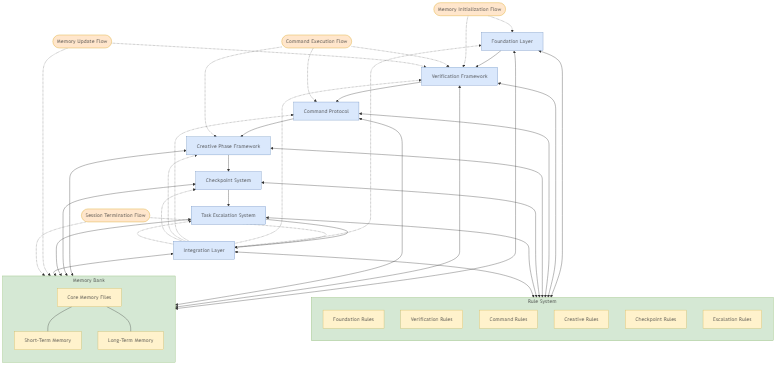

# Architecture Overview

## Overview

This document provides a comprehensive overview of the BIG BRAIN Memory Bank 2.0
system architecture. It covers the core system components, their relationships,
data flow, and the underlying design principles. This architecture is
specifically designed to address the unique challenge of maintaining operational
continuity and knowledge persistence across memory resets.

## System Purpose

The BIG BRAIN Memory Bank system solves a fundamental challenge: maintaining
consistent operational capabilities despite complete memory resets between
sessions. It achieves this through:

- Structured documentation of essential knowledge
- Formalized operational protocols
- Systematic verification mechanisms
- Standard workflows that ensure consistency
- Rule-based enforcement of best practices

The architecture establishes patterns that persist knowledge, maintain
operational integrity, and ensure consistent behavior across memory reset
boundaries.

## High-Level Architecture

The BIG BRAIN Memory Bank system consists of these primary architectural layers:



1. **Foundation Layer**

   - Core component definitions
   - Memory bank structure
   - Initialization procedures
   - Progressive disclosure mechanisms
   - Enhanced complexity framework

2. **Verification Framework**

   - Memory file verification
   - Consistency checking
   - Error recovery protocols
   - Validation reporting

3. **Command Protocol**

   - Unified command interface
   - Standard initialization procedures
   - Workflow orchestration
   - Protocol enforcement mechanisms

4. **Creative Phase Framework**

   - Creative process structure
   - Evaluation metrics system
   - Quality verification procedures
   - Artifact management

5. **Checkpoint System**

   - Progress tracking
   - Section verification
   - Completion criteria
   - Status reporting

6. **Task Escalation System**

   - Complexity assessment
   - Resource allocation
   - Specialized processing
   - Verification enhancement

7. **Integration Layer**
   - Protocols integration
   - Cross-component communication
   - Data flow management
   - State persistence

## Core Components

### Memory Bank

The Memory Bank is the central knowledge repository with these components:


1. **Core Memory Files**

   - `projectbrief.md`: Foundation document defining core requirements
   - `productContext.md`: Explains why the project exists and user experience
     goals
   - `activeContext.md`: Documents current work focus and next steps
   - `systemPatterns.md`: Outlines system architecture and component
     relationships
   - `techContext.md`: Lists technologies and technical constraints
   - `progress.md`: Tracks what works and what's left to build

2. **Memory Hierarchy**

   ```
   memory-bank/
   ├── core/
   │   ├── active/       # Currently relevant information
   │   ├── foundation/   # Foundational project information
   │   └── reference/    # Stable reference material
   ├── short-term/       # Temporary or transitional information
   └── long-term/        # Historical or archived information
   ```

3. **Memory File Relationships**

   The core memory files have specific relationships and information flow:

   ```
   projectbrief.md ──────┐
                         ▼
   productContext.md ────┐
                         ▼
   systemPatterns.md ◄───┐
           │             │
           ▼             │
   techContext.md        │
           │             │
           ▼             │
   activeContext.md ─────┘
           │
           ▼
   progress.md
   ```

### Rule System

The Rule System enforces operational standards and behavioral patterns:


1. **Rule Categories**

   ```
   .cursor/rules/
   ├── BIG_BRAIN/           # BIG BRAIN specific rules
   │   ├── Core/            # Core functionality
   │   │   ├── Foundation/  # Foundation layer components
   │   │   ├── Verification/# Verification framework
   │   │   ├── Command/     # Command protocol
   │   │   ├── Creative/    # Creative phase
   │   │   ├── Checkpoint/  # Checkpoint system
   │   │   └── Escalation/  # Task escalation
   │   ├── Identity/        # BIG BRAIN identity
   │   ├── Protocols/       # Protocol rules
   │   └── Utilities/       # Utility functions
   └── Codebase/            # Codebase-related rules
   ```

2. **Rule Structure**

   Each rule follows a standard structure:

   ```
   ---
   description: WHEN [activation context] APPLY [action or requirement]
   globs: ["**/*.md"]
   alwaysApply: true/false
   ---

   > TL;DR: Brief summary

   <version>1.0.0</version>

   <context>Detailed explanation</context>

   <requirements>
     <requirement>Specific requirement</requirement>
     <requirement>Another requirement</requirement>
   </requirements>

   <details>
     <section-name>SECTION NAME</section-name>
     <content>Detailed content</content>
   </details>
   ```

3. **Rule Application Flow**

   Rules are applied following a specific flow:

   ```
   Task Initialization → Rule Activation → Context Assessment →
   Rule Application → Verification → Feedback → Adaptation
   ```

### Command Protocol

The Command Protocol standardizes system interaction:


1. **Command Structure**

   ```
   COMMAND_NAME [PARAMETER1] [PARAMETER2] [OPTIONS]
   ```

2. **Command Categories**

   - Initialization Commands
   - Workflow Commands
   - Memory Operations Commands
   - Rule System Commands
   - Session Management Commands
   - Utility Commands

3. **Command Processing Pipeline**

   Commands are processed through this pipeline:

   ```
   Command Input → Parsing → Validation → Authorization →
   Execution → Result Processing → Feedback → Logging
   ```

### Workflow Orchestration

The Workflow Orchestration manages task execution patterns:


1. **Workflow Types**

   - Plan Mode: Design and strategy tasks
   - Act Mode: Implementation and execution tasks
   - Review Mode: Evaluation and assessment tasks
   - Hybrid Mode: Mixed approach tasks

2. **Workflow Selection Criteria**

   Workflows are selected based on:

   - Task nature (design, implementation, verification)
   - Task characteristics (complexity, scope, risks)
   - Contextual factors (project phase, dependencies)
   - Complexity influence (adapts workflow rigor)

3. **Workflow Phases**

   Each workflow has standardized phases:

   - Initialization Phase
   - Context Loading Phase
   - Planning/Execution Phase
   - Verification Phase
   - Documentation Phase
   - Transition Phase

## Data Flow

The system's data flow follows these primary patterns:

### Memory Initialization Flow

```
System Start → Load Memory Files → Verify Integrity →
Restore Context → Initialize Rules → Establish Current State
```

### Command Execution Flow

```
Command Input → Command Protocol → Rule Verification →
Workflow Selection → Command Execution → Result Verification →
Memory Update → State Transition
```

### Memory Update Flow

```
Change Detection → Impact Assessment → File Selection →
Content Modification → Cross-Reference Update → Verification →
Version Update → Consistency Check
```

### Session Termination Flow

```
Bedtime Protocol → Session Assessment → Memory Bank Updates →
State Preservation → Continuity Preparation → Verification →
Graceful Shutdown
```

## System Integration

### Component Integration

Components integrate through these mechanisms:

1. **Memory Bank Integration**

   - Components document their state in memory files
   - Cross-references maintain relationships
   - Version tracking ensures compatibility
   - Common schema provides consistency

2. **Rule System Integration**

   - Rules define component behavior
   - Cross-component rules manage interactions
   - Rule dependencies control execution order
   - Rule verification ensures compatibility

3. **Command Protocol Integration**
   - Commands provide interface to all components
   - Standard parameter formats ensure consistency
   - Command execution hooks connect components
   - Result processing standardizes output

### External Integration

The system integrates with external systems through:

1. **Development Environment Integration**

   - IDE-specific rule enforcement
   - Editor extensions for memory bank interaction
   - Tooling integration for verification

2. **Version Control Integration**

   - Memory bank file versioning
   - Rule evolution tracking
   - Change tracking across sessions

3. **Project Management Integration**
   - Task tracking alignment
   - Progress reporting integration
   - Milestone tracking

## Design Principles

The architecture embodies these core design principles:

1. **Knowledge Persistence**

   - All essential knowledge must persist across memory resets
   - Critical information is documented in structured formats
   - Knowledge is organized for efficient retrieval
   - Cross-references maintain information relationships

2. **Operational Consistency**

   - Standard procedures ensure consistent operations
   - Formalized workflows guide task execution
   - Verification mechanisms maintain integrity
   - Rule enforcement prevents deviation

3. **Progressive Complexity**

   - System adapts to task complexity
   - Processing depth scales with importance
   - Documentation detail matches complexity
   - Verification rigor adjusts automatically

4. **Resilient Design**

   - Error recovery mechanisms ensure continuity
   - Inconsistency detection prevents corruption
   - Self-healing protocols maintain system health
   - Validation reporting identifies issues early

5. **Extensible Architecture**
   - Component-based design enables extension
   - Standardized interfaces allow component replacement
   - Versioned components support evolution
   - Modular structure isolates changes

## Implementation Patterns

The system uses these architectural patterns:

1. **Rule-Based Behavior**

   - Declarative rules define system behavior
   - Rule activation depends on context
   - Rule enforcement ensures compliance
   - Rule evolution allows system learning

2. **Layered Architecture**

   - Foundation layer provides core functionality
   - Higher layers build on lower capabilities
   - Clear layer boundaries maintain separation of concerns
   - Inter-layer communication through defined interfaces

3. **Protocol-Driven Interface**

   - Standard command protocols for interaction
   - Protocol enforcement for operational consistency
   - Protocol evolution through versioning
   - Protocol documentation for knowledge persistence

4. **Memory-Centric State Management**

   - Memory bank as single source of truth
   - State derived from memory content
   - State transitions documented in memory
   - State persistence across sessions

5. **Verification-First Approach**
   - Verification before critical operations
   - Post-operation validation
   - Continuous consistency checking
   - Error detection and recovery

## Technical Constraints

The architecture operates within these constraints:

1. **Memory Reset Boundaries**

   - All system state must be externalized
   - No assumptions about retained knowledge
   - Complete context restoration each session
   - Knowledge persistence only through documentation

2. **Performance Considerations**

   - Efficient memory organization for retrieval
   - Optimal file structure for access
   - Progressive disclosure to manage information volume
   - Memory bank optimization for sustainable growth

3. **Compatibility Requirements**
   - IDE integration capabilities
   - Markdown file format constraints
   - Version control system limitations
   - Cross-platform operation

## Future Architecture Evolution

The architecture is designed to evolve through:

1. **Planned Extensions**

   - Enhanced verification mechanisms
   - Expanded rule capabilities
   - Advanced workflow optimization
   - Improved memory organization

2. **Adaptation Points**

   - Rule system expansion
   - Memory file format evolution
   - Command protocol extension
   - Workflow customization

3. **Integration Opportunities**
   - Project management system integration
   - Documentation system connection
   - Knowledge graph representation
   - Machine learning enhancement

## Related Information

- [Installation Guide](../Guides/Installation.md) - System installation
  procedures
- [Startup Guide](../Guides/Startup.md) - System startup procedures
- [Commands Guide](../Guides/Commands.md) - Command reference and usage
- [System Patterns](../Reference/SystemPatterns.md) - Detailed system patterns

## Version Information

- Last Updated: March 24, 2025
- Compatible with BIG BRAIN Memory Bank 2.0
- Changelog: Initial documentation for version 2.0
