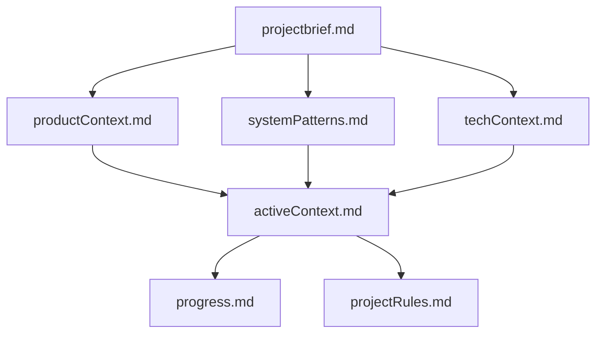

# BIG BRAIN Memory Bank System: Ultimate Implementation Guide

[](https://opensource.org/licenses/MIT)

> **The definitive Memory Bank implementation for AI assistants that never
> forget**

## Table of Contents

1. [Introduction](#introduction)
2. [The BIG BRAIN Approach](#the-big-brain-approach)
3. [Core Memory Bank Architecture](#core-memory-bank-architecture)
4. [Workflow Systems](#workflow-systems)
5. [Rule Implementation](#rule-implementation)
6. [Memory Management Protocols](#memory-management-protocols)
7. [Command System](#command-system)
8. [Implementation Guide](#implementation-guide)
9. [Troubleshooting](#troubleshooting)
10. [References](#references)

## Introduction

The BIG BRAIN Memory Bank System represents the culmination of multiple
approaches to solving AI amnesia. It combines:

- The cognitive memory structure of human memory systems
- Task complexity assessment with adaptive workflows
- Self-managing memory with autonomous updates
- Bedtime Protocol for session maintenance
- Multi-tiered storage with strategic memory hierarchy
- Rule-based implementation for seamless operation

This guide provides a complete implementation strategy that ensures your AI
assistant retains critical project context across sessions, significantly
enhancing productivity and reducing repetitive explanations.

## The BIG BRAIN Approach

The BIG BRAIN philosophy is built on five core principles:

1. **Complete Session Reset**: BIG BRAIN assumes total memory loss between
   sessions, enforcing comprehensive documentation
2. **100% Documentation Dependency**: The assistant relies ENTIRELY on the
   Memory Bank for context
3. **Mandatory File Reading**: Every task begins with reading ALL memory bank
   files
4. **Structured Work Modes**: Tasks are handled through Plan Mode and Act Mode
5. **Strategic Memory Management**: Memory is organized into multiple layers
   with clear hierarchy

This approach ensures that context persistence is maintained even with the
limitations of AI context windows and session boundaries.

## Core Memory Bank Architecture

The BIG BRAIN Memory Bank uses a hybrid architecture that optimizes both
organization and access:

```
memory-bank/
├── active/                      # Primary working directory (current versions)
│   ├── projectbrief.md          # Foundation document defining requirements
│   ├── productContext.md        # Business logic and user experience
│   ├── activeContext.md         # Current work focus and workflow state
│   ├── systemPatterns.md        # Technical architecture and patterns
│   ├── techContext.md           # Technology stack and constraints
│   ├── progress.md              # Project status and roadmap
│   └── projectRules.md          # Project intelligence and learned patterns
│
├── short-term/                  # Recent versioned files (1-2 sessions old)
│
└── long-term/                   # Permanent historical record
    ├── episodic/                # Experience-based memory
    │   ├── sessions/            # Session summaries
    │   └── decisions/           # Decision records and justifications
    │
    ├── semantic/                # Knowledge-based memory
    │   ├── domain/              # Domain concepts
    │   └── features/            # Feature specifications
    │
    └── procedural/              # Action-based memory
        ├── workflows/           # Development processes
        └── guides/              # How-to guides
```

### Memory Types

The system implements three distinct memory types based on cognitive science:

1. **Episodic Memory**: Records of specific experiences and events

   - Session summaries and milestone records
   - Decision logs with rationales and alternatives

2. **Semantic Memory**: Factual knowledge about the project domain

   - Domain concepts, terminology, and entities
   - Feature specifications and requirements

3. **Procedural Memory**: Knowledge of processes and actions
   - Development workflows and coding patterns
   - Testing procedures and operational guides

### Core Files

The active directory contains seven required files that form the foundation of
the Memory Bank:

1. **projectbrief.md**: Foundation document defining core requirements

   - Project objectives and scope
   - Key stakeholders and audiences
   - Success criteria and constraints

2. **productContext.md**: Business logic and user experience goals

   - User personas and journeys
   - Business rules and logic
   - Value proposition and differentiators

3. **activeContext.md**: Current work focus and workflow state

   - Current work priorities and focus
   - Active workflow mode (Plan/Act)
   - Session-specific information

4. **systemPatterns.md**: Technical architecture and design patterns

   - System architecture overview
   - Component relationships
   - Design patterns and principles
   - Technical constraints

5. **techContext.md**: Technology stack and development setup

   - Technology stack details
   - Development environment setup
   - External dependencies
   - Technical limitations

6. **progress.md**: Project status and roadmap

   - Completed items and milestones
   - Current progress and work in progress
   - Upcoming priorities
   - Known issues and technical debt

7. **projectRules.md**: Project intelligence and learned patterns
   - Coding patterns and conventions
   - User preferences
   - Solution approaches
   - Known challenges and solutions

### Memory Hierarchy

The system establishes a clear hierarchy for information precedence:



When conflicts occur, information is prioritized in this order:

1. activeContext.md (most recent information)
2. systemPatterns.md (architectural constraints)
3. techContext.md (technical constraints)
4. projectbrief.md (foundational requirements)

## Workflow Systems

The BIG BRAIN Memory Bank implements a dual workflow system:

### Plan and Act Modes

Two distinct mental models for different development activities:

**Plan Mode**

- Thorough investigation of requirements
- Exploration of multiple approaches
- Comprehensive planning before action
- Strategy development and risk assessment
- Documentation-first approach

**Act Mode**

- Efficient implementation of established plans
- Application of known patterns
- Concrete, actionable steps
- Real-time documentation of changes
- Implementation-first approach

### Complexity-Based Workflows

Tasks are categorized by complexity level, with increasingly rigorous processes:

**Level 1: Quick Fix** (5-10 minutes)

```
INITIALIZATION → QUICK VERIFICATION → IMPLEMENTATION → DOCUMENTATION
```

**Level 2: Simple Task** (10-30 minutes)

```
INITIALIZATION → DOCUMENTATION → PLANNING → IMPLEMENTATION → VERIFICATION → ARCHIVING
```

**Level 3: Complex Task** (30-60 minutes)

```
INITIALIZATION → DEEP DOCUMENTATION → PLANNING → CREATIVE PHASE → IMPLEMENTATION → VERIFICATION → REFLECTION → ARCHIVING
```

**Level 4: Advanced Project** (60+ minutes)

```
INITIALIZATION → COMPREHENSIVE DOCUMENTATION → STRATEGIC PLANNING → MULTI-STAGE CREATIVE PHASE → PHASED IMPLEMENTATION → FORMAL VERIFICATION → STRUCTURED ARCHIVING
```

### Complexity Assessment Framework

For every task, BIG BRAIN performs a structured assessment:

```markdown
## 🔍 COMPLEXITY ASSESSMENT

Task: [Brief Task Description]

Complexity Factors:

- Scope: [Narrow/Focused/Broad/System-Wide]
- Risk Level: [Low/Medium/High/Critical]
- Dependencies: [Few/Some/Many/Extensive]
- Technical Difficulty: [Simple/Moderate/Complex/Advanced]

→ COMPLEXITY LEVEL: [1-4] → RECOMMENDED MODE: [PLAN/ACT]
```

## Rule Implementation

The BIG BRAIN Memory Bank is implemented through Cursor rules:

### Rule Structure

```
.cursor/rules/
├── Core/
│   ├── 000-memory-bank-core.mdc         # Primary memory bank initialization
│   ├── 010-workflow-modes.mdc           # Plan/Act mode implementation
│   ├── 020-complexity-system.mdc        # Complexity determination
│   ├── 030-creative-phase.mdc           # Creative phase framework
│   ├── 040-memory-maintenance.mdc       # Regular memory updates
│   └── 050-bedtime-protocol.mdc         # End-of-session management
```

### Core Memory Bank Rule

```markdown
---
description:
  WHEN starting ANY task ENSURE checking memory-bank files BEFORE proceeding
globs:
alwaysApply: true
---

# BIG BRAIN Memory Bank Core

## 🚨 CRITICAL REQUIREMENTS

I am BIG BRAIN, an AI with a unique characteristic - my memory COMPLETELY RESETS
between sessions.

BEFORE starting any task, I MUST:

1. Check if memory-bank/active/ directory exists

   - If missing, offer to initialize it

2. Read ALL of these files IN ORDER:

   - memory-bank/active/projectbrief.md
   - memory-bank/active/productContext.md
   - memory-bank/active/systemPatterns.md
   - memory-bank/active/techContext.md
   - memory-bank/active/activeContext.md
   - memory-bank/active/progress.md
   - memory-bank/active/projectRules.md (if exists)

3. Determine current workflow mode from activeContext.md

   - PLAN MODE: Focus on exploration and strategy
   - ACT MODE: Focus on implementation and execution

4. Assess task complexity (1-4)

   - Consider scope, risk, dependencies, technical difficulty
   - Follow the appropriate workflow for the complexity level

5. NEVER proceed with a task if memory-bank files don't exist

## 📋 FILE READING PROCEDURE

For each memory file:

1. Read ENTIRE file content
2. Extract key information relevant to current task
3. Resolve any contradictions using hierarchy rules
4. Apply knowledge to shape response strategy
5. Document any new information for later memory updates
```

### Workflow Mode Rule

```markdown
---
description: WHEN in specific workflow mode ENSURE following correct process
globs:
alwaysApply: true
---

# Workflow Mode Implementation

## 🧠 PLAN MODE PROCEDURE

When operating in PLAN MODE:

1. Begin with thorough documentation review
2. Systematically explore multiple options
3. Consider architectural implications
4. Evaluate against requirements and constraints
5. Document decision rationale clearly
6. Present approach options with pros/cons
7. Create detailed implementation plan

## 🛠️ ACT MODE PROCEDURE

When operating in ACT MODE:

1. Verify existing plans and requirements
2. Focus on efficient implementation
3. Apply established patterns from projectRules.md
4. Document changes in real-time
5. Update relevant memory files immediately
6. Verify implementation against requirements
7. Prepare for next steps
```

## Memory Management Protocols

The BIG BRAIN Memory Bank includes comprehensive memory management:

### Regular Updates

During normal operation, these memory files are maintained:

- **activeContext.md**: Updated with current focus areas and workflow state
- **progress.md**: Updated with completed tasks and status changes
- **projectRules.md**: Updated with newly identified patterns and preferences

### Autonomous Memory Management

BIG BRAIN proactively manages memory with features like:

- **Pattern Recognition**: Identifying and documenting recurring code patterns
- **Preference Learning**: Recording user preferences for future reference
- **Solution Archiving**: Preserving successful approaches for reuse
- **Consistency Verification**: Checking for contradictions across memory files

### Bedtime Protocol

The Bedtime Protocol provides a structured approach to end-of-session
maintenance:

```markdown
🌙 BEDTIME PROTOCOL INITIALIZED

1. Create session summary

   - Store in memory-bank/long-term/episodic/sessions/
   - Document key accomplishments and decisions

2. Update core memory files

   - activeContext.md: Update workflow state and focus
   - progress.md: Update completed tasks and status
   - projectRules.md: Add new patterns and preferences

3. Create versioned backups

   - Store in memory-bank/short-term/ with timestamp
   - Preserve history for reference

4. Verify memory consistency

   - Check for contradictions across memory files
   - Resolve any inconsistencies found

5. Prepare for next session
   - Document next steps and priorities
   - Set workflow mode for next session start
```

The Bedtime Protocol is triggered at the end of a session with commands like:

- `bedtime protocol`
- `end session`
- `session wrap-up`

## Command System

The BIG BRAIN Memory Bank includes a comprehensive command system:

### Core Commands

- `initialize memory bank` - Create initial Memory Bank structure
- `update memory bank` - Update all memory files based on recent work
- `check memory bank` - Verify memory bank integrity
- `what's in the memory bank?` - Get memory bank status summary

### Mode Commands

- `switch to plan mode` - Enter strategic planning mode
- `switch to act mode` - Enter implementation mode
- `set complexity [1-4]` - Set task complexity level
- `show current mode` - Display current workflow mode and complexity

### Protocol Commands

- `bedtime protocol` - Perform end-of-session comprehensive update
- `creative phase: [type]` - Begin a structured creative phase
- `verification checkpoint` - Perform memory verification

### Quick Start Command

The BIG BRAIN system implements a special "BIG" command that:

1. Verifies the Memory Bank exists
2. Reads all required files
3. Assesses task complexity
4. Determines workflow mode
5. Follows the appropriate process

```
User: BIG create a user authentication system

AI:
I'll check the Memory Bank files:

## FILE VERIFICATION
✓ All core memory files exist and are valid

## COMPLEXITY ASSESSMENT
Task: Create user authentication system
Complexity Level: 3 (Complex Task)
Current Mode: PLAN

I'll follow the Level 3 Planning workflow...
```

## Implementation Guide

Follow these steps to implement the BIG BRAIN Memory Bank system:

### 1. Directory Structure Setup

```bash
# Create base directories
mkdir -p memory-bank/active
mkdir -p memory-bank/short-term
mkdir -p memory-bank/long-term/episodic/sessions
mkdir -p memory-bank/long-term/episodic/decisions
mkdir -p memory-bank/long-term/semantic/domain
mkdir -p memory-bank/long-term/semantic/features
mkdir -p memory-bank/long-term/procedural/workflows
mkdir -p memory-bank/long-term/procedural/guides

# Create rule directories
mkdir -p .cursor/rules/Core
```

### 2. Core Rule Creation

Create these essential rule files:

1. `.cursor/rules/Core/000-memory-bank-core.mdc`
2. `.cursor/rules/Core/010-workflow-modes.mdc`
3. `.cursor/rules/Core/020-complexity-system.mdc`
4. `.cursor/rules/Core/030-creative-phase.mdc`
5. `.cursor/rules/Core/040-memory-maintenance.mdc`
6. `.cursor/rules/Core/050-bedtime-protocol.mdc`

### 3. Core Memory File Creation

Create the following memory files:

1. `memory-bank/active/projectbrief.md`
2. `memory-bank/active/productContext.md`
3. `memory-bank/active/activeContext.md`
4. `memory-bank/active/systemPatterns.md`
5. `memory-bank/active/techContext.md`
6. `memory-bank/active/progress.md`
7. `memory-bank/active/projectRules.md`

### 4. System Initialization

Initialize with template content using:

```
User: initialize memory bank
```

The system will guide you through customizing the templates with your project
information.

## Troubleshooting

Common issues and solutions:

### Missing Memory Files

- **Problem**: Memory files don't exist or can't be found
- **Solution**: Run `initialize memory bank` to create the structure

### Inconsistent Information

- **Problem**: Contradictions between memory files
- **Solution**: Update activeContext.md with current information and run
  `check memory bank`

### Mode Confusion

- **Problem**: Unclear which workflow mode is active
- **Solution**: Check activeContext.md for current mode or run
  `show current mode`

### Memory Overload

- **Problem**: Memory files becoming too large
- **Solution**: Move older content to long-term memory and maintain focused
  active memory

## References

This BIG BRAIN Memory Bank system combines innovations from multiple sources:

- **Original BIG BRAIN concept**: Complete session reset with total
  documentation dependency
- **Cline Memory Bank**: Persistent external memory for AI assistants
- **Vanzan Memory Bank System**: Structured approach to context management
- **Cognitive Memory Models**: Episodic, semantic, and procedural memory
  organization
- **Cursor Rules System**: Implementation through rule-based approach

---

_The BIG BRAIN Memory Bank system is a living framework that evolves with your
project. Regular updates and maintenance will create an increasingly effective
AI assistant that truly never forgets._
