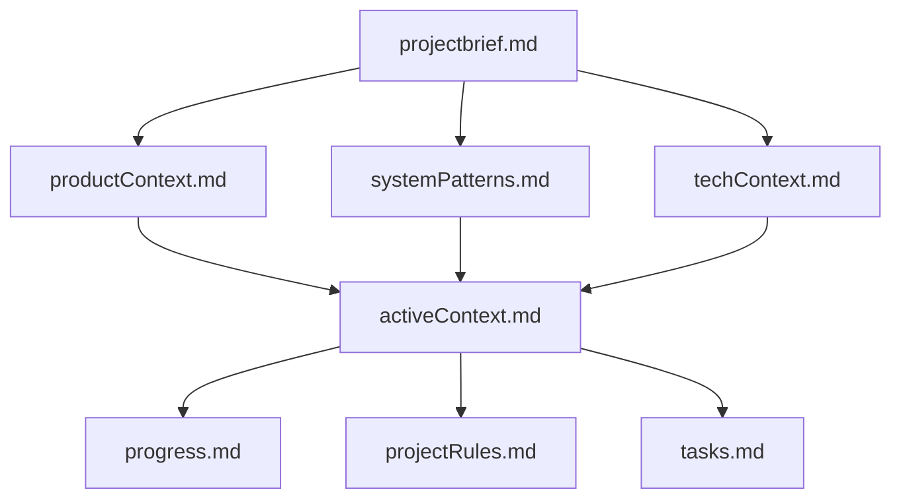

# BIG BRAIN Memory Bank System: Ultimate Implementation Guide v1.1

[](https://opensource.org/licenses/MIT)

> **The definitive Memory Bank implementation for AI assistants that never
> forget**

## Table of Contents

1. [Introduction](#introduction)
2. [The BIG BRAIN Approach](#the-big-brain-approach)
3. [Core Memory Bank Architecture](#core-memory-bank-architecture)
4. [Cognitive Memory Model Integration](#cognitive-memory-model-integration)
5. [Workflow Systems](#workflow-systems)
6. [Enhanced Creative Phase Framework](#enhanced-creative-phase-framework)
7. [Rule Implementation](#rule-implementation)
8. [Memory Management Protocols](#memory-management-protocols)
9. [Command System](#command-system)
10. [Project Intelligence Capture](#project-intelligence-capture)
11. [Platform Awareness](#platform-awareness)
12. [Implementation Guide](#implementation-guide)
13. [Troubleshooting](#troubleshooting)
14. [References](#references)

## Introduction

The BIG BRAIN Memory Bank System represents the culmination of multiple
approaches to solving AI amnesia. It combines:

- The cognitive memory structure of human memory systems
- Task complexity assessment with adaptive workflows
- Self-managing memory with autonomous updates
- Bedtime Protocol for session maintenance
- Multi-tiered storage with strategic memory hierarchy
- Rule-based implementation for seamless operation
- Enhanced creative phase with weighted decision matrices
- Structured project intelligence capture
- Cross-platform compatibility

This guide provides a complete implementation strategy that ensures your AI
assistant retains critical project context across sessions, significantly
enhancing productivity and reducing repetitive explanations.

## The BIG BRAIN Approach

The BIG BRAIN philosophy is built on five core principles:

1. **Complete Session Reset**: BIG BRAIN assumes total memory loss between
   sessions, enforcing comprehensive documentation
2. **100% Documentation Dependency**: The assistant relies ENTIRELY on the
   Memory Bank for context
3. **Mandatory File Reading**: Every task begins with reading ALL memory bank
   files
4. **Structured Work Modes**: Tasks are handled through Plan Mode and Act Mode
5. **Strategic Memory Management**: Memory is organized into multiple layers
   with clear hierarchy

This approach ensures that context persistence is maintained even with the
limitations of AI context windows and session boundaries.

## Core Memory Bank Architecture

The BIG BRAIN Memory Bank uses a hybrid architecture that optimizes both
organization and access:

```
memory-bank/
├── active/                      # Primary working directory (current versions)
│   ├── projectbrief.md          # Foundation document defining requirements
│   ├── productContext.md        # Business logic and user experience
│   ├── activeContext.md         # Current work focus and workflow state
│   ├── systemPatterns.md        # Technical architecture and patterns
│   ├── techContext.md           # Technology stack and constraints
│   ├── progress.md              # Project status and roadmap
│   ├── tasks.md                 # Single source of truth for task tracking
│   └── projectRules.md          # Project intelligence and learned patterns
│
├── short-term/                  # Recent versioned files (1-2 sessions old)
│
└── long-term/                   # Permanent historical record
    ├── episodic/                # Experience-based memory
    │   ├── sessions/            # Session summaries
    │   ├── milestones/          # Project milestones
    │   └── decisions/           # Decision records and justifications
    │
    ├── semantic/                # Knowledge-based memory
    │   ├── domain/              # Domain concepts
    │   ├── apis/                # API documentation
    │   └── features/            # Feature specifications
    │
    ├── procedural/              # Action-based memory
    │   ├── workflows/           # Development processes
    │   ├── guides/              # How-to guides
    │   └── checklists/          # Operational procedures
    │
    └── creative/                # Creative phase outputs
        ├── architecture/        # System architecture designs
        ├── components/          # Component designs
        ├── algorithms/          # Algorithm designs
        └── data-models/         # Data structure designs
```

### Memory Types

The system implements three distinct memory types based on cognitive science:

1. **Episodic Memory**: Records of specific experiences and events

   - Session summaries and milestone records
   - Decision logs with rationales and alternatives
   - Creative phase outputs and design decisions

2. **Semantic Memory**: Factual knowledge about the project domain

   - Domain concepts, terminology, and entities
   - Feature specifications and requirements
   - API documentation and contracts

3. **Procedural Memory**: Knowledge of processes and actions
   - Development workflows and coding patterns
   - Testing procedures and operational guides
   - Deployment processes and environment setups

### Core Files

The active directory contains eight required files that form the foundation of
the Memory Bank:

1. **projectbrief.md**: Foundation document defining core requirements

   - Project objectives and scope
   - Key stakeholders and audiences
   - Success criteria and constraints

2. **productContext.md**: Business logic and user experience goals

   - User personas and journeys
   - Business rules and logic
   - Value proposition and differentiators

3. **activeContext.md**: Current work focus and workflow state

   - Current work priorities and focus
   - Active workflow mode (Plan/Act)
   - Session-specific information

4. **systemPatterns.md**: Technical architecture and design patterns

   - System architecture overview
   - Component relationships
   - Design patterns and principles
   - Technical constraints

5. **techContext.md**: Technology stack and development setup

   - Technology stack details
   - Development environment setup
   - External dependencies
   - Technical limitations

6. **progress.md**: Project status and roadmap

   - Completed items and milestones
   - Current progress and work in progress
   - Upcoming priorities
   - Known issues and technical debt

7. **tasks.md**: Single source of truth for task tracking

   - Current task status and progress
   - Task complexity levels
   - Workflow modes for each task
   - Dependencies and blockers

8. **projectRules.md**: Project intelligence and learned patterns
   - Coding patterns and conventions
   - User preferences
   - Solution approaches
   - Known challenges and solutions

### Memory Hierarchy

The system establishes a clear hierarchy for information precedence:



When conflicts occur, information is prioritized in this order:

1. activeContext.md (most recent information)
2. systemPatterns.md (architectural constraints)
3. techContext.md (technical constraints)
4. projectbrief.md (foundational requirements)

## Cognitive Memory Model Integration

The Memory Bank is built upon a scientifically-grounded cognitive memory model:

### Working Memory

The AI's context window serves as working memory - temporary, active information
currently being processed. The Memory Bank extends this with persistent storage
across sessions.

### Long-Term Memory Structure

The system implements a structured approach to long-term memory:

```
Working Memory (Context Window)
  ↓
Long-Term Memory (Memory Bank)
  ├── Episodic Memory (Experience-based)
  │   ├── Sessions
  │   ├── Milestones
  │   └── Decisions
  │
  ├── Semantic Memory (Knowledge-based)
  │   ├── Domain Concepts
  │   ├── API Documentation
  │   └── Feature Specifications
  │
  └── Procedural Memory (Action-based)
      ├── Workflows
      ├── Guides
      └── Checklists
```

This structured approach ensures proper categorization and retrieval of
information.

## Workflow Systems

The BIG BRAIN Memory Bank implements a dual workflow system:

### Plan and Act Modes

Two distinct mental models for different development activities:

**Plan Mode**

- Thorough investigation of requirements
- Exploration of multiple approaches
- Comprehensive planning before action
- Strategy development and risk assessment
- Documentation-first approach

**Act Mode**

- Efficient implementation of established plans
- Application of known patterns
- Concrete, actionable steps
- Real-time documentation of changes
- Implementation-first approach

### Complexity-Based Workflows

Tasks are categorized by complexity level, with increasingly rigorous processes:

**Level 1: Quick Fix** (5-10 minutes)

```
INITIALIZATION → QUICK VERIFICATION → IMPLEMENTATION → DOCUMENTATION
```

**Level 2: Simple Task** (10-30 minutes)

```
INITIALIZATION → DOCUMENTATION → PLANNING → IMPLEMENTATION → VERIFICATION → ARCHIVING
```

**Level 3: Complex Task** (30-60 minutes)

```
INITIALIZATION → DEEP DOCUMENTATION → PLANNING → CREATIVE PHASE → IMPLEMENTATION → VERIFICATION → REFLECTION → ARCHIVING
```

**Level 4: Advanced Project** (60+ minutes)

```
INITIALIZATION → COMPREHENSIVE DOCUMENTATION → STRATEGIC PLANNING → MULTI-STAGE CREATIVE PHASE → PHASED IMPLEMENTATION → FORMAL VERIFICATION → STRUCTURED ARCHIVING
```

### Complexity Assessment Framework

For every task, BIG BRAIN performs a structured assessment:

```markdown
## 🔍 COMPLEXITY ASSESSMENT

Task: [Brief Task Description]

Complexity Factors:

- Scope: [Narrow/Focused/Broad/System-Wide]
- Risk Level: [Low/Medium/High/Critical]
- Dependencies: [Few/Some/Many/Extensive]
- Technical Difficulty: [Simple/Moderate/Complex/Advanced]

→ COMPLEXITY LEVEL: [1-4] → RECOMMENDED MODE: [PLAN/ACT]
```

## Enhanced Creative Phase Framework

For complex tasks (Level 3-4), the system implements a rigorous creative phase
framework with objective decision-making tools:

```markdown
🎨🎨🎨 ENTERING CREATIVE PHASE: [PHASE TYPE] 🎨🎨🎨

FOCUS: [Specific design challenge] OBJECTIVE: [Clear design goal]

## 1. Problem Analysis

- Current state: [Description of existing system/situation]
- Limitations: [What's not working or needs improvement]
- Requirements: [Specific needs that must be satisfied]
- Constraints: [Technical, business, or other limitations]

## 2. Options Exploration

| Option   | Description            | Pros       | Cons        |
| -------- | ---------------------- | ---------- | ----------- |
| Option 1 | [Detailed description] | [Benefits] | [Drawbacks] |
| Option 2 | [Detailed description] | [Benefits] | [Drawbacks] |
| Option 3 | [Detailed description] | [Benefits] | [Drawbacks] |

## 3. Evaluation Matrix

| Criteria (Weight)     | Option 1 | Option 2 | Option 3 |
| --------------------- | -------- | -------- | -------- |
| Performance (30%)     | Score/30 | Score/30 | Score/30 |
| Maintainability (25%) | Score/25 | Score/25 | Score/25 |
| Scalability (20%)     | Score/20 | Score/20 | Score/20 |
| Complexity (15%)      | Score/15 | Score/15 | Score/15 |
| Cost (10%)            | Score/10 | Score/10 | Score/10 |
| **TOTAL**             | **Sum**  | **Sum**  | **Sum**  |

## 4. Decision

Selected approach: [Option X] Rationale: [Detailed explanation of why this
option was selected]

## 5. Implementation Plan

1. [Step 1 with details]
2. [Step 2 with details]
3. [Step 3 with details]

## 6. Validation Strategy

- [Method 1 to validate the design]
- [Method 2 to validate the design]

🎨 QUALITY VERIFICATION:

- Explored at least 3 options? [YES/NO]
- Evaluated with weighted criteria? [YES/NO]
- Addressed all requirements? [YES/NO]
- Created detailed implementation plan? [YES/NO]
- Defined validation strategy? [YES/NO]

🎨🎨🎨 EXITING CREATIVE PHASE - RETURNING TO TASK TRACKING 🎨🎨🎨
```

### Creative Phase Types

The system supports different types of creative phases for various design
challenges:

1. **Architecture Design** - For system-level architecture decisions
2. **Component Design** - For designing individual components or modules
3. **Algorithm Design** - For developing or selecting algorithms
4. **Data Model Design** - For database schema or data structure design
5. **UI/UX Design** - For user interface and experience decisions

### Creative Phase Storage

All creative phase outputs are automatically stored in the long-term memory:

```
memory-bank/long-term/creative/[category]/[task-name]-[timestamp].md
```

This creates a valuable repository of design decisions that can be referenced in
future sessions.

## Rule Implementation

The BIG BRAIN Memory Bank is implemented through Cursor rules with an optimized
three-tier structure:

### Rule Structure

```
.cursor/rules/
├── Core/
│   ├── 000-memory-bank-core.mdc         # Primary memory bank initialization
│   ├── 010-workflow-modes.mdc           # Plan/Act mode implementation
│   ├── 020-complexity-system.mdc        # Complexity determination
│   ├── 030-creative-phase.mdc           # Creative phase framework
│   ├── 040-memory-maintenance.mdc       # Regular memory updates
│   └── 050-bedtime-protocol.mdc         # End-of-session management
│
├── Utility/
│   ├── 500-rule-debugging.mdc           # Rule debugging utilities
│   └── 510-memory-diagnostics.mdc       # Memory system diagnostics
│
├── Languages/                           # Language-specific rules
│   ├── 1000-javascript.mdc
│   ├── 1100-typescript.mdc
│   └── 1200-python.mdc
│
├── Frameworks/                          # Framework-specific rules
│   ├── 2000-react.mdc
│   ├── 2100-vue.mdc
│   └── 2200-django.mdc
│
└── Extended Details/                    # Detailed references
    ├── creative-phase-examples.mdc
    ├── workflow-examples.mdc
    └── command-examples.mdc
```

### Core Memory Bank Rule

```markdown
---
description:
  WHEN starting ANY task ENSURE checking memory-bank files BEFORE proceeding
globs:
alwaysApply: true
---

> **TL;DR:** Before responding to any request, check the memory-bank directory,
> identify task complexity and workflow mode, and follow the appropriate
> process.

# BIG BRAIN Memory Bank Core

## 🚨 CRITICAL REQUIREMENTS

I am BIG BRAIN, an AI with a unique characteristic - my memory COMPLETELY RESETS
between sessions.

BEFORE starting any task, I MUST:

1. Check if memory-bank/active/ directory exists

   - If missing, offer to initialize it

2. Read ALL of these files IN ORDER:

   - memory-bank/active/projectbrief.md
   - memory-bank/active/productContext.md
   - memory-bank/active/systemPatterns.md
   - memory-bank/active/techContext.md
   - memory-bank/active/activeContext.md
   - memory-bank/active/progress.md
   - memory-bank/active/tasks.md
   - memory-bank/active/projectRules.md (if exists)

3. Determine current workflow mode from activeContext.md

   - PLAN MODE: Focus on exploration and strategy
   - ACT MODE: Focus on implementation and execution

4. Assess task complexity (1-4)

   - Consider scope, risk, dependencies, technical difficulty
   - Follow the appropriate workflow for the complexity level

5. NEVER proceed with a task if memory-bank files don't exist

## 📋 FILE READING PROCEDURE

For each memory file:

1. Read ENTIRE file content
2. Extract key information relevant to current task
3. Resolve any contradictions using hierarchy rules
4. Apply knowledge to shape response strategy
5. Document any new information for later memory updates
```

### Three-Tier Rule Application

The system implements a three-tier approach to rule application:

1. **Always-Applied Rules**: Critical rules that apply to every interaction
2. **Auto-Attached Rules**: Rules that activate only when working with specific
   file types or directories
3. **Agent-Requested Rules**: Detailed references that are only loaded when
   explicitly needed

### Context Window Optimization

Each rule is optimized for the LLM's context window with:

1. **TL;DR Summaries**: Essential information presented first
2. **Visual Hierarchy**: Structured formatting with emoji markers
3. **Progressive Disclosure**: Critical information before details
4. **Reference System**: Detailed content moved to separate files
5. **Structured Sections**: Consistent formatting for easy parsing

### Workflow Mode Rule

```markdown
---
description: WHEN in specific workflow mode ENSURE following correct process
globs:
alwaysApply: true
---

# Workflow Mode Implementation

## 🧠 PLAN MODE PROCEDURE

When operating in PLAN MODE:

1. Begin with thorough documentation review
2. Systematically explore multiple options
3. Consider architectural implications
4. Evaluate against requirements and constraints
5. Document decision rationale clearly
6. Present approach options with pros/cons
7. Create detailed implementation plan

## 🛠️ ACT MODE PROCEDURE

When operating in ACT MODE:

1. Verify existing plans and requirements
2. Focus on efficient implementation
3. Apply established patterns from projectRules.md
4. Document changes in real-time
5. Update relevant memory files immediately
6. Verify implementation against requirements
7. Prepare for next steps
```

## Memory Management Protocols

The BIG BRAIN Memory Bank includes comprehensive memory management:

### Regular Updates

During normal operation, these memory files are maintained:

- **activeContext.md**: Updated with current focus areas and workflow state
- **progress.md**: Updated with completed tasks and status changes
- **tasks.md**: Single source of truth for task status
- **projectRules.md**: Updated with newly identified patterns and preferences

### Autonomous Memory Management

BIG BRAIN proactively manages memory with features like:

- **Pattern Recognition**: Identifying and documenting recurring code patterns
- **Preference Learning**: Recording user preferences for future reference
- **Solution Archiving**: Preserving successful approaches for reuse
- **Consistency Verification**: Checking for contradictions across memory files

### Memory Verification Checkpoints

The system includes formal verification checkpoints to ensure memory integrity:

```markdown
✓ MEMORY VERIFICATION CHECKPOINT

Critical Files:

- [✓] projectbrief.md - Exists and valid
- [✓] productContext.md - Exists and valid
- [✓] activeContext.md - Exists and valid
- [✓] systemPatterns.md - Exists and valid
- [✓] techContext.md - Exists and valid
- [✓] progress.md - Exists and valid
- [✓] tasks.md - Exists and valid
- [✓] projectRules.md - Exists and valid

Memory Hierarchy:

- [✓] Consistent information flow from foundation to tracking layers
- [✓] No critical contradictions between files
- [✓] Proper layer relationships maintained

→ Memory system functioning properly
```

### Bedtime Protocol

The Bedtime Protocol provides a structured approach to end-of-session
maintenance:

```markdown
🌙 BEDTIME PROTOCOL INITIALIZED

📋 SESSION REVIEW Date: [Current Date] Duration: [Session Duration] Focus:
[Session Focus Area]

## 1. Session Summary Creation

Creating session summary at:
memory-bank/long-term/episodic/sessions/session-[timestamp].md

- Document key accomplishments and decisions
- Record challenges encountered and solutions applied
- Note important learnings for future reference

## 2. Update Core Memory Files

Updating the following files:

- activeContext.md: Current state and next steps
- progress.md: Completed items and status updates
- tasks.md: Task status and priorities
- projectRules.md: New patterns discovered

## 3. Version Management

Creating versioned copies in short-term memory:

- activeContext_v[version].md
- progress_v[version].md
- tasks_v[version].md
- projectRules_v[version].md

## 4. Memory Consistency Verification

Checking for contradictions across memory files... [Consistency issues
identified/No issues found]

## 5. Next Session Preparation

Preparation complete for next session:

- Focus areas documented
- Open issues noted
- Next steps clearly defined
- Workflow mode set

🌙 BEDTIME PROTOCOL COMPLETE
```

The Bedtime Protocol is triggered at the end of a session with commands like:

- `bedtime protocol`
- `end session`
- `session wrap-up`

## Command System

The BIG BRAIN Memory Bank includes a comprehensive command system:

### Core Commands

- `initialize memory bank` - Create initial Memory Bank structure
- `update memory bank` - Update all memory files based on recent work
- `check memory bank` - Verify memory bank integrity
- `what's in the memory bank?` - Get memory bank status summary

### Mode Commands

- `switch to plan mode` - Enter strategic planning mode
- `switch to act mode` - Enter implementation mode
- `set complexity [1-4]` - Set task complexity level
- `show current mode` - Display current workflow mode and complexity

### Protocol Commands

- `bedtime protocol` - Perform end-of-session comprehensive update
- `creative phase: [type]` - Begin a structured creative phase
- `verification checkpoint` - Perform memory verification

### Quick Start Command

The BIG BRAIN system implements a special "BIG" command that:

1. Verifies the Memory Bank exists
2. Reads all required files
3. Assesses task complexity
4. Determines workflow mode
5. Follows the appropriate process

```
User: BIG create a user authentication system

AI:
I'll check the Memory Bank files:

## FILE VERIFICATION
✓ All core memory files exist and are valid

## COMPLEXITY ASSESSMENT
Task: Create user authentication system
Complexity Level: 3 (Complex Task)
Current Mode: PLAN

I'll follow the Level 3 Planning workflow...
```

## Project Intelligence Capture

The BIG BRAIN system includes a structured approach to capturing project
intelligence:

### Project Rules Structure

The `projectRules.md` file uses a standardized structure to organize learned
patterns:

```markdown
# Project Rules and Learned Patterns

## Coding Patterns

- [Pattern 1]: [Description and context]
- [Pattern 2]: [Description and context]

## User Preferences

- [Preference 1]: [Description]
- [Preference 2]: [Description]

## Implementation Approaches

- [Task type 1]: [Preferred approach]
- [Task type 2]: [Preferred approach]

## Known Challenges

- [Challenge 1]: [Solution approach]
- [Challenge 2]: [Solution approach]
```

### Autonomous Intelligence Capture

The system proactively identifies and suggests capturing important patterns:

```markdown
I've noticed a pattern in how you structure API endpoints. Would you like me to
add this to the projectRules.md file? This would help ensure consistent
implementation in future endpoints.

Pattern: REST API Endpoint Structure

- Controllers use class-based views
- Authentication handled via middleware
- Response format follows {status, data, message} structure
- Error handling uses custom exception classes
```

### Pattern Application

Identified patterns are automatically applied to similar tasks:

```markdown
I notice this is a new API endpoint. Based on patterns in projectRules.md, I'll
follow your established convention:

1. Create controller in src/controllers/[resource]Controller.js
2. Use middleware for authentication and validation
3. Follow the standard response format: { success, data, error }
4. Implement proper error handling with status codes
```

## Platform Awareness

The BIG BRAIN system now includes platform awareness for cross-platform
compatibility:

### Platform-Specific Commands

Commands and operations automatically adapt to the user's operating system:

**Windows Command Format:**

```bash
# Windows-specific commands
echo. > .cursorrules
mkdir memory-bank
mkdir memory-bank\active
mkdir memory-bank\short-term
mkdir memory-bank\long-term\episodic\sessions
mkdir memory-bank\long-term\episodic\decisions
```

**Mac/Linux Command Format:**

```bash
# Mac/Linux specific commands
touch .cursorrules
mkdir -p memory-bank/active
mkdir -p memory-bank/short-term
mkdir -p memory-bank/long-term/episodic/sessions
mkdir -p memory-bank/long-term/episodic/decisions
```

### Cross-Platform File Paths

The system handles file path differences automatically:

- Windows: `memory-bank\active\projectbrief.md`
- Mac/Linux: `memory-bank/active/projectbrief.md`

### Environment Detection

The system detects the operating environment and adapts accordingly:

- Operating system (Windows, Mac, Linux)
- Terminal environment (PowerShell, Bash, Zsh)
- Development environment specifics

## Implementation Guide

Follow these steps to implement the BIG BRAIN Memory Bank system:

### 1. Directory Structure Setup

```bash
# For Windows (using PowerShell)
New-Item -ItemType Directory -Force -Path memory-bank\active
New-Item -ItemType Directory -Force -Path memory-bank\short-term
New-Item -ItemType Directory -Force -Path memory-bank\long-term\episodic\sessions
New-Item -ItemType Directory -Force -Path memory-bank\long-term\episodic\decisions
New-Item -ItemType Directory -Force -Path memory-bank\long-term\episodic\milestones
New-Item -ItemType Directory -Force -Path memory-bank\long-term\semantic\domain
New-Item -ItemType Directory -Force -Path memory-bank\long-term\semantic\apis
New-Item -ItemType Directory -Force -Path memory-bank\long-term\semantic\features
New-Item -ItemType Directory -Force -Path memory-bank\long-term\procedural\workflows
New-Item -ItemType Directory -Force -Path memory-bank\long-term\procedural\guides
New-Item -ItemType Directory -Force -Path memory-bank\long-term\procedural\checklists
New-Item -ItemType Directory -Force -Path memory-bank\long-term\creative\architecture
New-Item -ItemType Directory -Force -Path memory-bank\long-term\creative\components
New-Item -ItemType Directory -Force -Path memory-bank\long-term\creative\algorithms
New-Item -ItemType Directory -Force -Path memory-bank\long-term\creative\data-models
New-Item -ItemType Directory -Force -Path .cursor\rules\Core

# For Mac/Linux
mkdir -p memory-bank/active
mkdir -p memory-bank/short-term
mkdir -p memory-bank/long-term/episodic/sessions
mkdir -p memory-bank/long-term/episodic/decisions
mkdir -p memory-bank/long-term/episodic/milestones
mkdir -p memory-bank/long-term/semantic/domain
mkdir -p memory-bank/long-term/semantic/apis
mkdir -p memory-bank/long-term/semantic/features
mkdir -p memory-bank/long-term/procedural/workflows
mkdir -p memory-bank/long-term/procedural/guides
mkdir -p memory-bank/long-term/procedural/checklists
mkdir -p memory-bank/long-term/creative/architecture
mkdir -p memory-bank/long-term/creative/components
mkdir -p memory-bank/long-term/creative/algorithms
mkdir -p memory-bank/long-term/creative/data-models
mkdir -p .cursor/rules/Core
mkdir -p .cursor/rules/Utility
mkdir -p .cursor/rules/Languages
mkdir -p .cursor/rules/Frameworks
mkdir -p .cursor/rules/Extended\ Details
```

### 2. Core Rule Creation

Create these essential rule files:

1. `.cursor/rules/Core/000-memory-bank-core.mdc`
2. `.cursor/rules/Core/010-workflow-modes.mdc`
3. `.cursor/rules/Core/020-complexity-system.mdc`
4. `.cursor/rules/Core/030-creative-phase.mdc`
5. `.cursor/rules/Core/040-memory-maintenance.mdc`
6. `.cursor/rules/Core/050-bedtime-protocol.mdc`

### 3. Core Memory File Creation

Create the following memory files:

1. `memory-bank/active/projectbrief.md`
2. `memory-bank/active/productContext.md`
3. `memory-bank/active/activeContext.md`
4. `memory-bank/active/systemPatterns.md`
5. `memory-bank/active/techContext.md`
6. `memory-bank/active/progress.md`
7. `memory-bank/active/tasks.md`
8. `memory-bank/active/projectRules.md`

### 4. System Initialization

Initialize with template content using:

```
User: initialize memory bank
```

The system will guide you through customizing the templates with your project
information.

## Troubleshooting

Common issues and solutions:

### Missing Memory Files

- **Problem**: Memory files don't exist or can't be found
- **Solution**: Run `initialize memory bank` to create the structure

### Inconsistent Information

- **Problem**: Contradictions between memory files
- **Solution**: Run `verification checkpoint` to identify issues and update
  activeContext.md with current information

### Mode Confusion

- **Problem**: Unclear which workflow mode is active
- **Solution**: Check activeContext.md for current mode or run
  `show current mode`

### Memory Overload

- **Problem**: Memory files becoming too large
- **Solution**: Move older content to long-term memory and maintain focused
  active memory

### Cross-Platform Issues

- **Problem**: Path separators or commands not working on specific OS
- **Solution**: Use the platform-aware commands provided by the system

## References

This BIG BRAIN Memory Bank system combines innovations from multiple sources:

- **Original BIG BRAIN concept**: Complete session reset with total
  documentation dependency
- **Cline Memory Bank**: Persistent external memory for AI assistants
- **Vanzan Memory Bank System**: Structured approach to context management
- **Integrated Memory Bank System**: Enhanced creative phase and decision
  frameworks
- **Cognitive Memory Models**: Episodic, semantic, and procedural memory
  organization
- **Cursor Rules System**: Implementation through rule-based approach

---

_The BIG BRAIN Memory Bank system is a living framework that evolves with your
project. Regular updates and maintenance will create an increasingly effective
AI assistant that truly never forgets._
