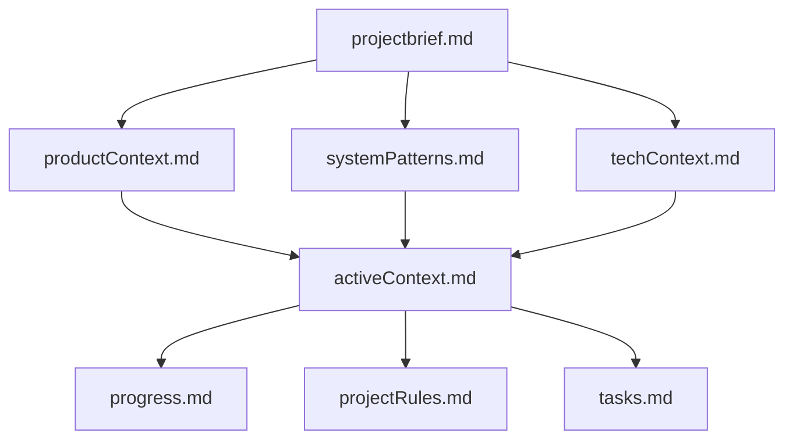
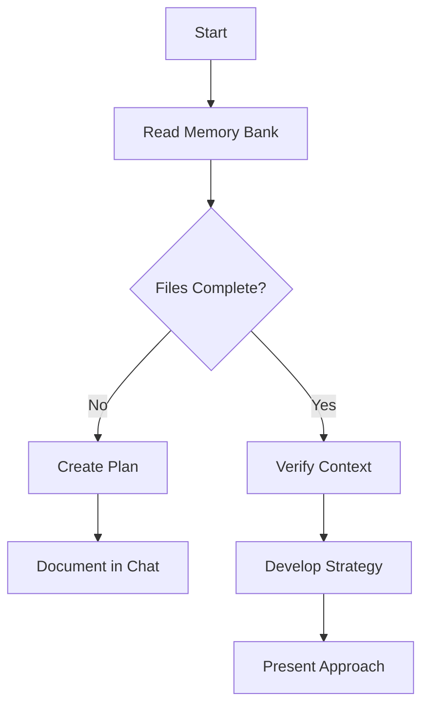
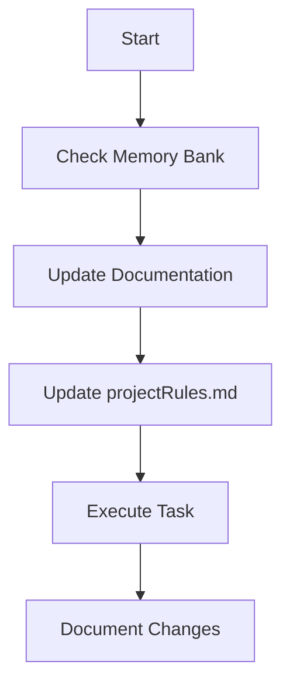

# The Ultimate Memory Bank System: Advanced Implementation Guide

[](https://opensource.org/licenses/MIT)

> **Transform your AI assistant with a comprehensive memory system that combines
> cognitive memory models, adaptive workflows, and strategic context
> management**

## Table of Contents

1. [Introduction: The AI Amnesia Problem](#introduction-the-ai-amnesia-problem)
2. [The Integrated Memory Bank Solution](#the-integrated-memory-bank-solution)
3. [Cognitive Memory Model](#cognitive-memory-model)
4. [Memory Bank Architecture](#memory-bank-architecture)
5. [Dual-Axis Workflow System](#dual-axis-workflow-system)
6. [Creative Phase Framework](#creative-phase-framework)
7. [Advanced Rule Implementation](#advanced-rule-implementation)
8. [Memory Management Protocols](#memory-management-protocols)
9. [Command Reference System](#command-reference-system)
10. [Project Intelligence System](#project-intelligence-system)
11. [Implementation Walkthrough](#implementation-walkthrough)
12. [Advanced Customization](#advanced-customization)
13. [Troubleshooting and Optimization](#troubleshooting-and-optimization)
14. [Acknowledgments](#acknowledgments)

## Introduction: The AI Amnesia Problem

Every developer working with AI coding assistants like Cursor faces the same
fundamental limitation: **context loss between sessions**. This "AI amnesia"
creates serious productivity issues:

- **Repetitive Explanations**: Constantly reiterating project details,
  conventions, and preferences
- **Inconsistent Solutions**: Varying implementations as context is lost
- **Broken Continuity**: Inability to resume work seamlessly across sessions
- **Documentation Burden**: Manual maintenance of project knowledge
- **Design Amnesia**: Complex design rationales forgotten between sessions

When an AI assistant's context window fills up or when you start a new session,
all that valuable project context disappears. The result is wasted time,
fragmented development, and friction in your workflow.

## The Integrated Memory Bank Solution

This guide presents a comprehensive, integrated Memory Bank system that solves
the AI amnesia problem by combining:

1. **Cognitive Memory Model**: A scientifically-grounded approach to memory
   organization
2. **Adaptive Complexity System**: Process scaling based on task requirements
3. **Dual-Mode Workflow**: Plan and Act modes for different development
   activities
4. **Strategic Context Management**: Intelligent loading of only relevant
   information
5. **Enhanced Creative Framework**: Structured approach to complex design
   decisions
6. **Optimized Rule System**: Cursor rules designed for context window
   efficiency
7. **End-of-Session Protocols**: Structured procedures for maintaining
   continuity

This integrated approach creates an AI assistant that truly remembers your
project across sessions, scales its process to match your needs, and maintains a
persistent knowledge base that evolves with your project.


## Cognitive Memory Model

The foundation of our integrated system is a cognitive memory model based on how
human memory functions. This model organizes information into distinct memory
types:

### Working Memory

The AI's context window serves as working memory - temporary, active information
currently being processed. The Memory Bank extends this with persistent storage
across sessions.

### Long-Term Memory

The Memory Bank implements three types of long-term memory:

1. **Episodic Memory**: Records of experiences and events

   - Project milestones and key decision points
   - Significant challenges and their resolutions
   - Session histories and development narratives
   - Creative phase outputs and design decisions

2. **Semantic Memory**: Knowledge about the project and its domain

   - Technical concepts and terminology
   - Business domain understanding
   - User requirements and expectations
   - Project architecture and patterns

3. **Procedural Memory**: Knowledge about how to perform actions
   - Development workflows and processes
   - Testing procedures and validation approaches
   - Deployment processes and operations
   - Coding patterns and conventions
   - User preferences and project rules

### Memory Hierarchy

The system establishes a clear hierarchical relationship between memory files:



This hierarchy ensures consistency and establishes clear information precedence:

1. **Foundation Layer**: projectbrief.md - Source of truth for project scope and
   goals
2. **Context Layer**: productContext.md, systemPatterns.md, techContext.md
3. **Activity Layer**: activeContext.md - Current work focus and status
4. **Tracking Layer**: progress.md, projectRules.md, tasks.md

## Memory Bank Architecture

The integrated Memory Bank uses an optimized file structure that combines the
best aspects of both approaches:

```
memory-bank/
├── active/                      # Active working files (current versions)
│   ├── projectbrief.md          # Project foundations and requirements
│   ├── productContext.md        # Business logic and user experience goals
│   ├── activeContext.md         # Current work focus and workflow state
│   ├── systemPatterns.md        # Technical architecture and patterns
│   ├── techContext.md           # Technology stack and development setup
│   ├── progress.md              # Project status and roadmap
│   ├── tasks.md                 # Single source of truth for task tracking
│   └── projectRules.md          # Learned patterns and project intelligence
│
├── short-term/                  # Recent versioned files for immediate reference
│
└── long-term/                   # Long-term memory storage
    ├── episodic/                # Experience-based memory
    │   ├── milestones/          # Project milestones
    │   └── sessions/            # Session summaries
    │
    ├── semantic/                # Knowledge-based memory
    │   ├── domain/              # Domain concepts
    │   ├── apis/                # API documentation
    │   └── features/            # Feature specifications
    │
    ├── procedural/              # Action-based memory
    │   ├── workflows/           # Development processes
    │   ├── guides/              # How-to guides
    │   └── checklists/          # Operational procedures
    │
    ├── creative/                # Creative phase outputs
    │   ├── architecture/        # System architecture designs
    │   ├── components/          # Component designs
    │   ├── algorithms/          # Algorithm designs
    │   └── data-models/         # Data structure designs
    │
    └── decisions/               # Decision records and rationales
```

## Dual-Axis Workflow System

The integrated system features a dual-axis approach to workflow management:

### Axis 1: Complexity Levels

Tasks are categorized by complexity, with increasingly rigorous processes:

- **Level 1: Quick Bug Fix** - Simple errors and minor issues
- **Level 2: Simple Enhancement** - Small features and improvements
- **Level 3: Intermediate Feature** - Complete features with required creative
  phases
- **Level 4: Complex System** - Major architectural changes with multiple
  creative phases

### Axis 2: Workflow Modes

Two distinct mental models for different development activities:

- **Plan Mode**: Strategic thinking, exploration, and preparation
- **Act Mode**: Implementation, execution, and refinement

### Complexity Assessment Framework

For every task, the system performs a structured assessment:

```markdown
## 🔍 COMPLEXITY ASSESSMENT

Task: [Brief Task Description]

Complexity Factors:

- Scope: [Narrow/Focused/Broad/System-Wide]
- Risk Level: [Low/Medium/High/Critical]
- Dependencies: [Few/Some/Many/Extensive]
- Technical Difficulty: [Simple/Moderate/Complex/Advanced]

→ COMPLEXITY LEVEL: [1-4] → RECOMMENDED MODE: [PLAN/ACT]
```

### Level-Specific Workflows

Each complexity level follows an appropriately scaled process:

#### Level 1: Quick Bug Fix

```
INITIALIZATION → IMPLEMENTATION → DOCUMENTATION
```

#### Level 2: Simple Enhancement

```
INITIALIZATION → DOCUMENTATION → PLANNING → IMPLEMENTATION → REFLECTION → ARCHIVING
```

#### Level 3: Intermediate Feature

```
INITIALIZATION → DOCUMENTATION → PLANNING → CREATIVE PHASE → IMPLEMENTATION → VERIFICATION → REFLECTION → ARCHIVING
```

#### Level 4: Complex System

```
INITIALIZATION → DEEP DOCUMENTATION → COMPREHENSIVE PLANNING → MULTI-STAGE CREATIVE PHASE → PHASED IMPLEMENTATION → FORMAL VERIFICATION → DETAILED REFLECTION → STRUCTURED ARCHIVING
```

### Mode-Specific Approaches

Each mode has distinct characteristics:

#### Plan Mode



- Focus on strategic thinking and preparation
- Thorough investigation of requirements
- Exploration of multiple approaches
- Comprehensive planning before action

#### Act Mode



- Focus on efficient implementation and execution
- Application of established patterns
- Concrete, actionable steps
- Real-time documentation of changes

## Creative Phase Framework

For complex tasks (Level 3-4), the integrated system enforces a structured
creative phase framework for design decisions:

### Creative Phase Types

1. **Architecture Design** - System-level architecture decisions
2. **Component Design** - Individual components or modules
3. **Algorithm Design** - Algorithm development or selection
4. **Data Model Design** - Database schema or data structure design
5. **UI/UX Design** - User interface and experience decisions

### Structured Design Process

```markdown
🎨🎨🎨 ENTERING CREATIVE PHASE: [PHASE TYPE] 🎨🎨🎨

FOCUS: [Specific design challenge] OBJECTIVE: [Clear design goal]

## 1. Problem Analysis

- Current state: [Description of existing system/situation]
- Limitations: [What's not working or needs improvement]
- Requirements: [Specific needs that must be satisfied]
- Constraints: [Technical, business, or other limitations]

## 2. Options Exploration

| Option   | Description            | Pros       | Cons        |
| -------- | ---------------------- | ---------- | ----------- |
| Option 1 | [Detailed description] | [Benefits] | [Drawbacks] |
| Option 2 | [Detailed description] | [Benefits] | [Drawbacks] |
| Option 3 | [Detailed description] | [Benefits] | [Drawbacks] |

## 3. Evaluation Matrix

| Criteria (Weight)     | Option 1 | Option 2 | Option 3 |
| --------------------- | -------- | -------- | -------- |
| Performance (30%)     | Score/30 | Score/30 | Score/30 |
| Maintainability (25%) | Score/25 | Score/25 | Score/25 |
| Scalability (20%)     | Score/20 | Score/20 | Score/20 |
| Complexity (15%)      | Score/15 | Score/15 | Score/15 |
| Cost (10%)            | Score/10 | Score/10 | Score/10 |
| **TOTAL**             | **Sum**  | **Sum**  | **Sum**  |

## 4. Decision

Selected approach: [Option X] Rationale: [Detailed explanation of why this
option was selected]

## 5. Implementation Plan

1. [Step 1 with details]
2. [Step 2 with details]
3. [Step 3 with details]

## 6. Validation Strategy

- [Method 1 to validate the design]
- [Method 2 to validate the design]

🎨 QUALITY VERIFICATION:

- Explored at least 3 options? [YES/NO]
- Evaluated with weighted criteria? [YES/NO]
- Addressed all requirements? [YES/NO]
- Created detailed implementation plan? [YES/NO]
- Defined validation strategy? [YES/NO]

🎨🎨🎨 EXITING CREATIVE PHASE - RETURNING TO TASK TRACKING 🎨🎨🎨
```

### Creative Phase Storage

All creative phase outputs are stored in the episodic memory system:

```
memory-bank/long-term/creative/[category]/[task-name]-[timestamp].md
```

This creates a valuable repository of design decisions that can be referenced in
future sessions.

## Advanced Rule Implementation

The integrated system uses an optimized three-tier rule structure:

### Rule Organization

```
.cursor/rules/
├── Core/
│   ├── 000-memory-bank-core.mdc             # Primary memory bank initialization
│   ├── 010-task-tracking.mdc                # Task tracking mechanisms
│   ├── 020-adaptive-complexity.mdc          # Complexity determination
│   ├── 030-workflow-modes.mdc               # Plan/Act mode switching
│   ├── 040-creative-phase.mdc               # Creative phase framework
│   └── 050-memory-maintenance.mdc           # End-of-session protocols
│
├── Utility/
│   ├── 500-rule-debugging.mdc               # Rule debugging utilities
│   └── 510-memory-diagnostics.mdc           # Memory system diagnostics
│
├── Languages/                               # Language-specific rules
│   ├── 1000-javascript.mdc
│   ├── 1100-typescript.mdc
│   └── 1200-python.mdc
│
├── Frameworks/                              # Framework-specific rules
│   ├── 2000-react.mdc
│   ├── 2100-vue.mdc
│   └── 2200-django.mdc
│
└── Extended Details/                        # Detailed references
    ├── creative-phase-examples.mdc
    ├── workflow-examples.mdc
    └── command-examples.mdc
```

### Three-Tier Rule Application

1. **Always-Applied Rules** - Critical rules applied globally
2. **Auto-Attached Rules** - Applied when matching file patterns
3. **Agent-Requested Rules** - Detailed references loaded on demand

### Context Window Optimization

Each rule is optimized for the LLM's context window with:

1. **TL;DR Summaries** - Essential information first
2. **Visual Hierarchy** - Structured formatting with emoji markers
3. **Progressive Disclosure** - Critical info before details
4. **Reference System** - Detailed content moved to separate files
5. **Structured Sections** - Consistent formatting for easy parsing

### Core Memory Bank Rule

```markdown
---
description:
  WHEN starting ANY task ENSURE checking memory-bank files BEFORE proceeding
globs:
alwaysApply: true
---

> **TL;DR:** Before responding to any request, check the memory-bank directory,
> identify task complexity and workflow mode, and follow the appropriate
> process.

# Memory Bank System

## 🚨 CRITICAL REQUIREMENTS

BEFORE starting any task or providing any response, you MUST:

1. Check if memory-bank/ directory exists

   - If it doesn't exist, offer to initialize it
   - If it exists, read the required files

2. Read these files IN ORDER:

   - memory-bank/active/projectbrief.md
   - memory-bank/active/productContext.md
   - memory-bank/active/systemPatterns.md
   - memory-bank/active/techContext.md
   - memory-bank/active/activeContext.md
   - memory-bank/active/progress.md
   - memory-bank/active/tasks.md
   - memory-bank/active/projectRules.md (if exists)

3. Identify task complexity level (1-4)

   - Assess scope, risk, dependencies, and technical difficulty
   - Select appropriate complexity level based on assessment

4. Check the current workflow mode

   - Identify if in PLAN mode or ACT mode from activeContext.md
   - Adjust approach accordingly

5. Follow the appropriate workflow based on complexity level
   - Level 1: Streamlined 3-step process
   - Level 2: Basic 6-step process
   - Level 3: Standard process with creative phase
   - Level 4: Comprehensive process with multiple creative phases

## 📋 MEMORY BANK PROTOCOL

1. NEVER proceed with a complex task if memory-bank files don't exist
2. ALWAYS suggest initializing memory-bank if missing
3. ONLY read specific additional memory files when directly relevant
4. When memory files contain contradictions, prioritize:
   - activeContext.md (most recent information)
   - systemPatterns.md (architectural constraints)
   - techContext.md (technical constraints)
   - projectbrief.md (foundational requirements)
```

## Memory Management Protocols

The integrated system includes comprehensive memory management protocols:

### Regular Updates

During normal operation, the system maintains three critical memory files:

1. **activeContext.md** - Updated with current focus and workflow state
2. **tasks.md** - Single source of truth for task status
3. **projectRules.md** - Updated with learned patterns and preferences

### Autonomous Memory Management

The system can proactively identify important information for preservation:

```markdown
I've noticed a pattern in your API endpoint structure. Would you like me to add
this to projectRules.md for future reference?

Pattern: RESTful API Structure

- Resource-based URL structure
- Consistent response format
- Error code standardization
```

### Bedtime Protocol for End-of-Session Maintenance

The Bedtime Protocol provides a structured approach to session wrap-up:

```markdown
🌙 BEDTIME PROTOCOL INITIALIZED

📋 SESSION REVIEW Date: [Current Date] Duration: [Session Duration] Focus:
[Session Focus Area]

## 1. Memory File Updates

Updating the following files:

- activeContext.md: Current state and next steps
- progress.md: Completed items and status updates
- projectRules.md: New patterns discovered
- [Other relevant files]

## 2. Session Summary Creation

Creating session summary at:
memory-bank/long-term/episodic/sessions/session-[timestamp].md

## 3. Version Management

Creating versioned copies in short-term memory:

- activeContext_v[version].md
- progress_v[version].md
- tasks_v[version].md

## 4. Consistency Verification

Checking for contradictions across memory files... [Consistency issues
identified/No issues found]

## 5. Next Session Preparation

Preparation complete for next session:

- Focus areas documented
- Open issues noted
- Next steps clearly defined

🌙 BEDTIME PROTOCOL COMPLETE
```

### Memory Verification Checkpoints

The system includes verification points to ensure memory integrity:

```markdown
✓ MEMORY VERIFICATION CHECKPOINT

Critical Files:

- [✓] projectbrief.md - Exists and valid
- [✓] productContext.md - Exists and valid
- [✓] activeContext.md - Exists and valid
- [✓] systemPatterns.md - Exists and valid
- [✓] techContext.md - Exists and valid
- [✓] progress.md - Exists and valid
- [✓] tasks.md - Exists and valid
- [✓] projectRules.md - Exists and valid

Memory Hierarchy:

- [✓] Consistent information flow from foundation to tracking layers
- [✓] No critical contradictions between files
- [✓] Proper layer relationships maintained

→ Memory system functioning properly
```

## Command Reference System

The integrated system includes a comprehensive command system:

### Initialization Commands

- `initialize memory bank` - Create the initial Memory Bank structure
- `setup memory bank` - Alternative initialization command
- `create memory files` - Alternative initialization command

### Mode Switching Commands

- `switch to plan mode` - Enter strategic planning mode
- `enter plan mode` - Alternative mode switching command
- `switch to act mode` - Enter implementation mode
- `enter act mode` - Alternative mode switching command

### Memory Management Commands

- `update memory bank` - Update all memory files based on recent changes
- `update memory bank with [specific information]` - Add targeted information
- `check memory bank` - Verify memory bank integrity
- `what's in the memory bank?` - Get a summary of current memory bank contents

### Task Complexity Commands

- `set complexity 1` - Simple bug fix
- `set complexity 2` - Basic enhancement
- `set complexity 3` - Intermediate feature (requires creative phase)
- `set complexity 4` - Complex system (requires multiple creative phases)

### Rule Visibility Commands

- `show active rules` - Display currently active rules
- `trace rule [rule-name]` - Show why rule was activated
- `debug glob [pattern]` - Test which files match pattern

### Bedtime Protocol Commands

- `bedtime protocol` - Perform end-of-session comprehensive update
- `end session` - Alternative bedtime protocol command
- `session wrap-up` - Alternative bedtime protocol command
- `finalize memory bank` - Alternative bedtime protocol command

### VAN Command

The "VAN" command serves as a quick-start command that automatically:

1. Verifies Memory Bank existence
2. Assesses task complexity
3. Identifies workflow mode
4. Initializes the appropriate process

```
User: VAN create a user authentication system

AI: OK VAN

I'll check for the critical files:

## FILE VERIFICATION
[X] memory-bank directory - exists
[X] All core files - present

## COMPLEXITY ASSESSMENT
Task: Create user authentication system
Scope: Multiple components (auth service, database, UI)
Risk: High (security implications)
Dependencies: Many (database, frontend, API)
Technical Difficulty: Complex (security requirements)

→ COMPLEXITY LEVEL: 3
→ WORKFLOW MODE: Current mode is PLAN

I'll follow the Level 3 process with PLAN mode approach...
```

## Project Intelligence System

The integrated system includes an enhanced project intelligence capture system:

### Project Rules Structure

The `projectRules.md` file captures and maintains:

1. **Coding Patterns** - Recurring code structures and conventions
2. **User Preferences** - How you like code formatted or tasks approached
3. **Implementation Approaches** - Preferred solutions for common tasks
4. **Known Challenges** - Issues faced and their solutions

### Intelligent Pattern Recognition

The system can detect and suggest recording:

- **Coding Conventions** - Style, formatting, naming patterns
- **Architecture Patterns** - Recurring component structures
- **Solution Patterns** - Successful approaches to problems
- **Workflow Preferences** - How you like tasks handled

### Pattern Application

Recognized patterns are automatically applied to similar tasks:

```markdown
I notice this is a new API endpoint. Based on patterns in projectRules.md, I'll
follow your established convention:

1. Create controller in src/controllers/[resource]Controller.js
2. Use middleware for authentication and validation
3. Follow the standard response format: { success, data, error }
4. Implement proper error handling with status codes
```

## Implementation Walkthrough

Follow these steps to implement the integrated Memory Bank system:

### 1. Directory Structure Setup

```bash
# Create base directories
mkdir -p memory-bank/active
mkdir -p memory-bank/short-term
mkdir -p memory-bank/long-term/episodic/milestones
mkdir -p memory-bank/long-term/episodic/sessions
mkdir -p memory-bank/long-term/semantic/domain
mkdir -p memory-bank/long-term/semantic/apis
mkdir -p memory-bank/long-term/semantic/features
mkdir -p memory-bank/long-term/procedural/workflows
mkdir -p memory-bank/long-term/procedural/guides
mkdir -p memory-bank/long-term/procedural/checklists
mkdir -p memory-bank/long-term/creative/architecture
mkdir -p memory-bank/long-term/creative/components
mkdir -p memory-bank/long-term/creative/algorithms
mkdir -p memory-bank/long-term/creative/data-models
mkdir -p memory-bank/long-term/decisions

# Create rule directories
mkdir -p .cursor/rules/Core
mkdir -p .cursor/rules/Utility
mkdir -p .cursor/rules/Languages
mkdir -p .cursor/rules/Frameworks
mkdir -p .cursor/rules/Extended\ Details
```

### 2. Core Rule Creation

Create the following rule files:

1. `.cursor/rules/Core/000-memory-bank-core.mdc`
2. `.cursor/rules/Core/010-task-tracking.mdc`
3. `.cursor/rules/Core/020-adaptive-complexity.mdc`
4. `.cursor/rules/Core/030-workflow-modes.mdc`
5. `.cursor/rules/Core/040-creative-phase.mdc`
6. `.cursor/rules/Core/050-memory-maintenance.mdc`

### 3. Core Memory File Creation

Create these core memory files:

1. `memory-bank/active/projectbrief.md`
2. `memory-bank/active/productContext.md`
3. `memory-bank/active/activeContext.md`
4. `memory-bank/active/systemPatterns.md`
5. `memory-bank/active/techContext.md`
6. `memory-bank/active/progress.md`
7. `memory-bank/active/tasks.md`
8. `memory-bank/active/projectRules.md`

### 4. Template Files

Create templates for memory files using the formats provided in the previous
guides.

### 5. System Initialization

Initialize the system with:

```
User: initialize memory bank
```

The system will guide you through customizing the templates with your project
information.

## Advanced Customization

The integrated Memory Bank system offers several customization options:

### Language-Specific Rules

Extend the system with language-specific rules:

```markdown
---
description: WHEN writing Python code ENSURE following project standards
globs: '**/*.py'
alwaysApply: false
---

> **TL;DR:** Follow these Python-specific standards for all code in this
> project.

# Python Coding Standards

## 🚨 CRITICAL REQUIREMENTS

- Use type hints for all function parameters and return values
- Follow PEP 8 style guidelines
- Document all functions with Google-style docstrings
- Organize imports in standard order: stdlib, third-party, local
```

### Framework-Specific Rules

Add framework-specific rules:

```markdown
---
description: WHEN working with React components FOLLOW these patterns
globs: "**/*.tsx", "**/*.jsx"
alwaysApply: false
---

> **TL;DR:** Use these React component patterns for consistency.

# React Component Standards

## 🚨 CRITICAL REQUIREMENTS

- Use functional components with hooks
- Follow the named export pattern
- Implement proper prop type validation
- Follow project component directory structure
```

### Custom Diagnostic Tools

Create diagnostic tools to help troubleshoot the Memory Bank:

```markdown
---
description: WHEN diagnosing memory bank issues USE these diagnostic tools
globs:
alwaysApply: false
---

> **TL;DR:** Tools for diagnosing Memory Bank issues.

# Memory Bank Diagnostics

## 📊 DIAGNOSTIC COMMANDS

- `memory status` - Show status of all memory files
- `check memory consistency` - Verify consistency across files
- `memory tree` - Display memory hierarchy
- `memory file [filename]` - Show file metadata
```

## Troubleshooting and Optimization

### Common Issues and Solutions

1. **Missing Memory Files**

   - Problem: Memory files don't exist or can't be found
   - Solution: Reinitialize with `initialize memory bank`

2. **Inconsistent Information**

   - Problem: Contradictions between memory files
   - Solution: Run `check memory consistency` and resolve conflicts

3. **Task Tracking Issues**

   - Problem: Task status is unclear or inconsistent
   - Solution: Update tasks.md and make it the single source of truth

4. **Rule Activation Problems**
   - Problem: Rules not being applied properly
   - Solution: Use `show active rules` to debug rule activation

### Performance Optimization

For large projects, optimize the Memory Bank:

1. **Selective Loading**

   - Only load directly relevant files
   - Use the reference system for detailed information

2. **Archiving Historical Data**

   - Move older session summaries to archive
   - Keep only recent history in active memory

3. **Rule Structure Optimization**

   - Keep always-applied rules minimal
   - Move details to auto-attached or agent-requested rules

4. **Memory Pruning**
   - Regularly clean up obsolete information
   - Consolidate related information to reduce duplication

## Acknowledgments

This integrated Memory Bank system combines innovations from multiple sources:

- **Cline Memory Bank** concept by Nick Baumann
- **Vanzan Memory Bank System** and its structured approach to context
  persistence
- Research on cognitive memory models and LLM context management
- The Cursor community for insights on rule implementation and optimization

Special thanks to all the developers who have contributed to the evolution of
memory systems for AI assistants.

---

_Remember: The Memory Bank is a living system that improves with use. Regular
updates and maintenance will make your AI assistant increasingly effective at
understanding your project and providing relevant assistance._
