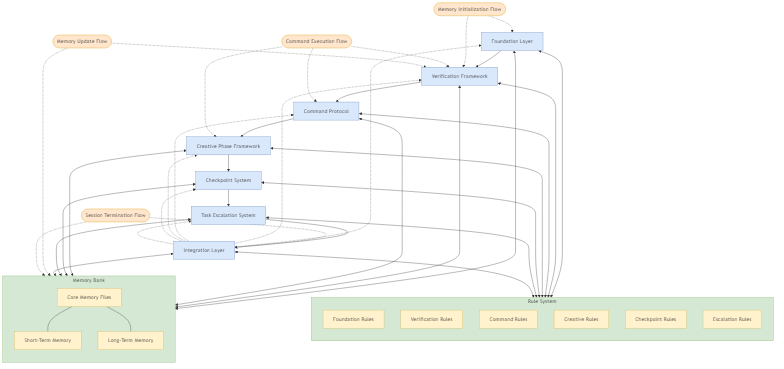

# System Patterns

This document outlines the system architecture, technical decisions, and
component relationships for the BIG BRAIN Memory Bank system.

## System Diagram

The BIG BRAIN Memory Bank 2.0 implements a hierarchical, modular architecture
composed of seven main layers that work together to maintain perfect context
between sessions. The architecture combines the original BIG BRAIN memory
framework with enhanced components to create a robust, adaptable memory
structure.

The system architecture is documented using standardized Mermaid diagrams
located in the `/images` directory, with generated image files in
`/docs/assets`. These diagrams follow the styling conventions defined in the
diagram standards rule.



Key architectural diagrams include:

- **System Architecture**: High-level view of all architectural layers
- **Memory Bank Structure**: Organization of memory files and directories
- **Rule System Structure**: Rule categories and relationships
- **Command Protocol**: Command structure and processing flow
- **Workflow Orchestration**: Workflow types and execution processes

These diagrams are maintained in Mermaid format (.mermaid) to ensure they can be
easily updated, versioned, and regenerated as the system evolves.

### Architectural Layers

1. **Foundation Layer**

   - The newly implemented base layer provides essential infrastructure for all
     other components
   - Defines core frameworks, protocols, and systems that enable adaptive memory
     functions │ - Establishes standardized interfaces for inter-layer
     communication │ - Includes the adaptive complexity framework, reference
     verification, task tracking, and command protocols

2. **Memory Layer**

   - Specialized storage structures for different types of information
   - Core memory files provide essential project context
   - Long-term memory repositories store durable knowledge
   - Session-based working memory handles temporary context
   - Procedural memory captures reusable patterns and workflows

3. **Workflow Layer**

   - Process patterns for different operational modes
   - Plan mode for exploration and architecture
   - Act mode for implementation and execution
   - Hybrid workflows for complex scenarios
   - Bedtime protocol for session transitions

4. **Interface Layer**
   - Interaction patterns and communication protocols
   - Command protocols for consistent instruction processing
   - Status indicators for system feedback
   - Memory update triggers for maintenance
   - Context switches for mode transitions

## Key Enhancements in BIG BRAIN 2.0

### Structured Verification Mechanisms

- Enhanced reference verification system with formal formats and verification
  indicators
- Multi-level verification depth based on task complexity
- Integration with memory updates and bedtime protocol

### Creative Phase Framework

- Comprehensive metrics for creative phase quality assessment
- Structured exploration, validation, and verification processes
- Complexity-adaptive creative phases
- Documentation requirements and evaluation matrix templates

### Integrated BIG Command Protocol

- Unified initialization approach for all Memory Bank operations
- Automatic platform detection and adaptation
- Task complexity assessment with appropriate workflow setup
- Consistent verification and response formats

### Adaptive Complexity Framework

- Four-level complexity assessment with objective criteria
- Appropriate process rigor scaled to task complexity
- Documentation and verification requirements by level
- Support for complexity reassessment when factors change

## Core Memory Architecture

The core memory architecture implements a cognitive memory model with these
components:

- **Core Memory Files**

  - `projectbrief.md`: Foundation document defining core project requirements
  - `productContext.md`: Problem/solution space and user experience goals
  - `activeContext.md`: Current work focus and state
  - `systemPatterns.md`: System architecture and component relationships
  - `techContext.md`: Technology stack and development setup
  - `progress.md`: Feature status and issues tracking

- **Long-term Memory**

  - Architecture documentation
  - Decision records
  - Established patterns
  - Historical context

- **Working Memory**
  - Session-focused context
  - Current task tracking
  - In-progress ideas
  - Temporary references

## Workflow Modes

The system operates in three primary workflow modes:

### Plan Mode

Used for tasks requiring exploration, architecture design, and decision-making.
Features include:

- Thorough requirements investigation
- Exploration of implementation options
- Architectural decision-making
- Documentation-focused approach

### Act Mode

Used for implementation, coding, and execution tasks. Features include:

- Direct implementation of established plans
- Testing and validation
- Incremental progress tracking
- Output-focused approach

### Hybrid Mode

Used for complex tasks requiring both planning and implementation. Features
include:

- Interleaved planning and execution
- Progressive elaboration
- Continuous validation
- Adaptive process switching

## Process Patterns

### Bedtime Protocol

End-of-session process for preserving context. Key steps include:

- Memory Bank consistency verification
- Documentation of current state
- Update of activeContext.md and progress.md
- Preparation for next session

### Task Complexity Assessment

Process for determining appropriate task handling based on complexity:

- Four-level complexity scale (1-4)
- Assessment based on scope, risk, dependencies, and technical difficulty
- Corresponding process rigor for each level
- Support for complexity escalation when needed

### Section Checkpoint System

Process for tracking progress through multi-step tasks:

- Clear section boundaries with completion criteria
- Verification at section boundaries
- Documentation of section outcomes and insights
- Support for resumption after interruptions

## Implementation Decisions

### Memory Representation

- Use Markdown for all memory files for readability and portability
- Hierarchical organization mirroring cognitive memory models
- Clear separation of active vs. reference memory
- Standardized formats for consistency

### Verification Approach

- Multi-level verification appropriate to task complexity
- Reference verification with explicit indicators
- Section checkpoints for process validation
- Integration with memory updates

### Command Structure

- Unified command protocol with the BIG command
- Hierarchical command organization
- Consistent command formats and responses
- Platform-aware command processing

## Technology Stack

- File System: Standard directory structure in repository
- File Formats: Markdown (.md) and Markdown Configuration (.mdc)
- Processing: Rule-based implementation in .cursor/rules
- Integration: Cursor IDE integration with defined globs and triggers

## Conceptual Relationships

```
BIG BRAIN Memory Bank
↓
┌─────────────────────────────────────────────┐
│              Cognitive Model                │
├─────────────┬─────────────┬─────────────────┤
│  Semantic   │  Episodic   │   Procedural    │
│   Memory    │   Memory    │     Memory      │
│             │             │                 │
│ (Reference  │ (Project    │ (Workflows &    │
│   files)    │  history)   │   patterns)     │
└─────────────┴─────────────┴─────────────────┘
              ↓
┌─────────────────────────────────────────────┐
│            Memory Processes                 │
├─────────────┬─────────────┬─────────────────┤
│  Encoding   │ Retrieval   │ Consolidation   │
│             │             │                 │
│(Documentation│(Reference  │ (Bedtime        │
│  updates)   │ verification)│ protocol)      │
└─────────────┴─────────────┴─────────────────┘
              ↓
┌─────────────────────────────────────────────┐
│            Operational Modes                │
├─────────────┬─────────────┬─────────────────┤
│  Plan Mode  │  Act Mode   │ Hybrid Mode     │
│             │             │                 │
│(Exploration)│(Execution)  │(Complex tasks)  │
└─────────────┴─────────────┴─────────────────┘
```

## Version History

| Version | Date       | Author    | Changes                                         |
| ------- | ---------- | --------- | ----------------------------------------------- |
| 1.0.0   | 2025-01-15 | BIG BRAIN | Initial system architecture                     |
| 2.0.0   | 2025-03-24 | BIG BRAIN | Enhanced architecture with new foundation layer |

## System Implementation Patterns

### Script Organization Structure

The BIG BRAIN Memory Bank system implements a categorical script organization
pattern to enhance maintainability, discoverability, and scalability. This
pattern ensures scripts are logically grouped by function while maintaining
backward compatibility.

Key aspects of the script organization pattern:

1. **Categorical Organization**: Scripts are organized into functional
   categories:

   - **Init**: Initialization scripts for system setup
   - **Update**: Scripts for updating system components
   - **Organization**: Scripts for managing file and rule organization
   - **Visualization**: Scripts for generating diagrams and visual
     representations
   - **Utilities**: General utility scripts for common operations
   - **Core**: Essential scripts duplicated for ease of access
   - **Backup**: Scripts and storage for backup operations
   - **Bedtime**: Scripts for session transition management
   - Additional categories for specialized functions (Verification, Analytics,
     etc.)

2. **Backward Compatibility**:

   - Critical scripts are maintained in both their original location and
     categorized folders
   - References to scripts in other components use path-finding logic to locate
     scripts in either location

3. **Documentation and Discovery**:

   - Each category includes a README.md file describing its purpose
   - A comprehensive ScriptCatalog.md documents all scripts across categories
   - Placeholder scripts indicate planned functionality

4. **Extensibility**:
   - The pattern allows for easy addition of new categories as system
     capabilities expand
   - Each category can evolve independently while maintaining system coherence

This organization pattern aligns with the BIG BRAIN Memory Bank's emphasis on
systematic organization, clear documentation, and adaptive structure.

### Code Patterns
