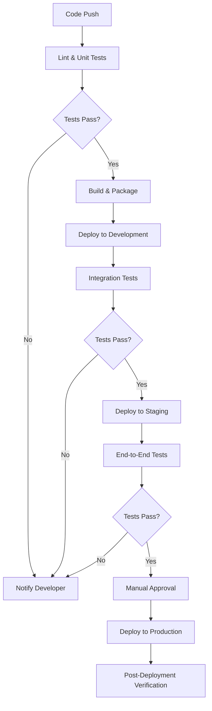

# Deployment Process

This document outlines the standardized deployment process for this project,
including CI/CD pipelines, environment configurations, and operations
procedures.

## 🚀 Deployment Environments

| Environment | Purpose                          | URL                         | Access Level              |
| ----------- | -------------------------------- | --------------------------- | ------------------------- |
| Development | Daily development deployments    | https://dev.example.com     | All developers            |
| Staging     | Pre-release testing              | https://staging.example.com | QA team, Product Managers |
| Production  | Live customer-facing environment | https://example.com         | Operations team only      |

## 📋 CI/CD Pipeline

Our continuous integration and deployment pipeline uses GitHub Actions with the
following stages:



## 🔄 Deployment Procedures

### Development Deployment

**Trigger**: Automatic on merge to `develop` branch **Frequency**: Multiple
times per day

1. Code is merged to the `develop` branch
2. GitHub Actions pipeline runs lint checks and unit tests
3. If tests pass, application is built and packaged
4. Deployment to development environment occurs automatically
5. Integration tests run against development environment
6. Developers are notified of success or failure

### Staging Deployment

**Trigger**: Automatic on merge to `release/*` branch **Frequency**: Weekly or
per release cycle

1. Release branch is created from `develop`
2. Final bug fixes and refinements are made
3. When ready, pipeline deploys to staging
4. End-to-end tests run against staging environment
5. QA team performs manual verification
6. Issues are fixed on the release branch
7. Process repeats until release is approved

### Production Deployment

**Trigger**: Manual approval after staging verification **Frequency**: Bi-weekly
or monthly

1. Release is approved by product owner
2. Operations team schedules deployment window
3. Manual approval is given in the CI/CD pipeline
4. Deployment to production occurs
5. Smoke tests verify basic functionality
6. Traffic is gradually shifted to new version (canary deployment)
7. Metrics are monitored for 24 hours
8. Release branch is merged to `main`

## 🔧 Deployment Commands

### Building the Application

```bash
# Install dependencies
npm install

# Run tests
npm test

# Build for production
npm run build

# Create Docker image
docker build -t myapp:latest .
```

### Deploying with Docker

```bash
# Pull the latest image
docker pull myapp:latest

# Stop the running container
docker stop myapp-container

# Remove the old container
docker rm myapp-container

# Start the new container
docker run -d --name myapp-container -p 3000:3000 myapp:latest

# Verify the container is running
docker ps | grep myapp
```

### Database Migrations

```bash
# Check migration status
npm run migration:status

# Run pending migrations
npm run migration:run

# Rollback last migration (if needed)
npm run migration:revert
```

## 🚨 Rollback Procedure

If issues are detected after deployment:

1. Notify the on-call engineer via PagerDuty
2. Make a decision whether to fix forward or roll back
3. If rolling back:

   ```bash
   # Revert to previous image
   docker pull myapp:previous

   # Stop and remove current container
   docker stop myapp-container
   docker rm myapp-container

   # Start container with previous version
   docker run -d --name myapp-container -p 3000:3000 myapp:previous
   ```

4. If database rollback is needed:
   ```bash
   npm run migration:revert
   ```
5. Update status in incident management system
6. Send notification to stakeholders

## 📊 Monitoring and Alerts

After deployment, monitor the following metrics for at least 24 hours:

- Application error rate (should be <1%)
- API response times (should be <300ms p95)
- CPU and memory usage (should be <80%)
- Database query performance (should be <100ms average)

Alerts are configured in Datadog with the following thresholds:

- Error rate > 5% for 5 minutes
- Response time > 1s for 10 minutes
- Any 5xx errors in production

## 🔑 Access Management

| Role             | Access Level                          | Request Process                    |
| ---------------- | ------------------------------------- | ---------------------------------- |
| Developer        | Development environment only          | Automatic with team membership     |
| QA Engineer      | Development and Staging               | JIRA request with manager approval |
| DevOps           | All environments                      | JIRA request with CTO approval     |
| On-call Engineer | Production read-only, emergency write | Automatic with on-call rotation    |

## 📝 Version History

| Version | Date       | Author    | Changes               |
| ------- | ---------- | --------- | --------------------- |
| 0.1     | 2025-03-23 | BIG BRAIN | Initial documentation |
